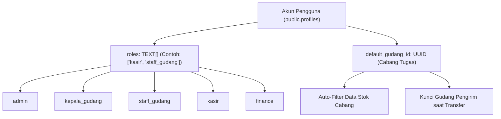

# Dokumentasi Role & Matriks Hak Akses (RBAC) - BMS Inventory

Dokumen ini menjelaskan arsitektur hak akses berbasis peran (Role-Based Access Control / RBAC) yang diterapkan pada sistem inventori & kasir multi-cabang BMS.

---

## 1. Arsitektur Multi-Role & Binding Lokasi

Sistem menggunakan model **Multi-Role**: satu akun pengguna dapat memiliki beberapa role sekaligus yang disimpan dalam kolom `roles TEXT[]` pada tabel `public.profiles`.

Selain itu, setiap akun staf dapat dikaitkan dengan lokasi kerja spesifik melalui `default_gudang_id UUID REFERENCES public.gudang(id)`.

---

## 2. Definisi & Tanggung Jawab 5 Role Utama

| Role | Nama Peran | Tanggung Jawab Utama |
| :--- | :--- | :--- |
| **`admin`** | Administrator (Super Admin) | Kontrol penuh seluruh modul sistem, pengaturan multi-cabang, manajemen pengguna, dan penyesuaian level database. |
| **`kepala_gudang`** | Kepala Gudang (Warehouse Lead) | Pengawasan operasional gudang, approval penyesuaian Stok Opname, approval pemusnahan barang rusak (Waste), dan PO restock suplier. |
| **`staff_gudang`** | Staf Gudang (Warehouse Staff) | Pelaksana teknis logistik, pembuatan surat jalan mutasi barang, penerimaan fisik di cabang tujuan, dan pengajuan draft barang rusak. |
| **`kasir`** | Kasir (Point of Sale) | Pelayanan transaksi penjualan, scanner barcode belanja, cetak struk nota, dan retur penjualan dari pelanggan. |
| **`finance`** | Keuangan & Akuntansi | Pemantauan HPP / laba kotor, pengelolaan Buku Besar / Jurnal Umum, kas masuk/keluar operasional, dan penggajian payroll. |

---

## 3. Matriks Kemampuan & Batasan Fitur

| Modul / Fitur | Admin | Kepala Gudang | Staf Gudang | Kasir | Finance |
| :--- | :---: | :---: | :---: | :---: | :---: |
| **Katalog Master & Stok** | | | | | |
| &bull; Lihat Daftar Barang & Stok Global | ✅ | ✅ | ✅ | ✅ | ✅ |
| &bull; **Lihat Harga Beli (HPP)** | **✅** | ❌ *(Disembunyikan)* | ❌ *(Disembunyikan)* | ❌ *(Disembunyikan)* | **✅** |
| &bull; Tambah & Hapus SKU Barang Master | ✅ | ❌ | ❌ | ❌ | ❌ |
| &bull; Edit Metadata Barang (Nama, Barcode, Kategori) | ✅ | ✅ | ❌ | ❌ | ❌ |
| &bull; Input Angka Stok Opname Fisik | ✅ | ✅ | ✅ | ❌ | ❌ |
| &bull; **Persetujuan (Approval) Selisih Stok Opname** | **✅** | **✅** | ❌ | ❌ | ❌ |
| **Gudang & Logistik Cabang** | | | | | |
| &bull; Lihat Stok per Lokasi Gudang / Cabang | ✅ | ✅ | ✅ *(Auto-Binding)* | ❌ | ✅ |
| &bull; Edit Posisi Rak / Bin (`rak_lokasi`) | ✅ | ✅ | ✅ | ❌ | ❌ |
| &bull; Ubah Batas Peringatan Min / Max Stok Rak | ✅ | ✅ | ❌ *(Read-only)* | ❌ | ❌ |
| &bull; Buat Surat Jalan Transfer Stok Antar Gudang | ✅ | ✅ | ✅ *(Gudang Asal Terkunci)* | ❌ | ❌ |
| &bull; Konfirmasi Penerimaan Fisik Barang Masuk | ✅ | ✅ | ✅ | ❌ | ❌ |
| &bull; Batalkan Dokumen Transfer | ✅ | ✅ | ❌ | ❌ | ❌ |
| &bull; **Pengeluaran Barang Rusak / Expired (Waste)** | **Langsung Eksekusi** | **Langsung Eksekusi** | **Ajukan (Draft)** | ❌ | ❌ |
| &bull; **Persetujuan / Approval Draft Waste** | **✅** | **✅** | ❌ | ❌ | ❌ |
| &bull; Kelola Master Gudang / Cabang Baru | ✅ | ❌ | ❌ | ❌ | ❌ |
| **Kasir & Transaksi Penjualan** | | | | | |
| &bull; Akses Mesin Kasir / POS Penjualan | ✅ | ❌ | ❌ | ✅ | ❌ |
| &bull; Riwayat Transaksi Belanja & Cetak Nota | ✅ | ❌ | ❌ | ✅ | ✅ |
| &bull; Retur Penjualan dari Pelanggan | ✅ | ❌ | ❌ | ✅ | ❌ |
| **Keuangan & Pembelian** | | | | | |
| &bull; Buku Besar Akuntansi & Jurnal Penyesuaian | ✅ | ❌ | ❌ | ❌ | ✅ |
| &bull; Arus Kas (Cash Flow) & Biaya Operasional Toko | ✅ | ❌ | ❌ | ❌ | ✅ |
| &bull; PO Restock Pembelian ke Supplier | ✅ | ✅ | ❌ | ❌ | ✅ |
| &bull; Kelola Master Data Supplier Vendor | ✅ | ✅ | ❌ | ❌ | ✅ |
| **Pengaturan & HR** | | | | | |
| &bull; Kelola Akun Pengguna & Role (`/users`) | ✅ | ❌ | ❌ | ❌ | ❌ |
| &bull; Penggajian & Slip Gaji Karyawan (Payroll) | ✅ | ❌ | ❌ | ❌ | ✅ |

---

## 4. Alur Operasional (SOP)

### 4.1 Alur Pengeluaran Barang Rusak / Kadaluarsa (Waste)
1. **Pengajuan oleh Staf Gudang**:
   - Staf membuka menu `/warehouse/outbound` &rarr; *"Ajukan Pengeluaran (Draft)"*.
   - Dokumen tersimpan dengan status `DRAFT`. **Stok fisik belum berkurang**.
2. **Persetujuan oleh Kepala Gudang / Admin**:
   - Kepala Gudang membuka dokumen pengeluaran berstatus `DRAFT`.
   - Mengklik **"Setujui & Eksekusi Potong Stok"**: Saldo stok fisik di `inventory_stocks` langsung dipotong secara atomik melalui RPC `approve_pengeluaran_gudang`, dan jurnal `BEBAN_SUSUT_GUDANG` otomatis tercatat pada Buku Besar.
   - Atau mengklik **"Tolak Pengajuan"** dengan mengisi catatan alasan penolakan.

### 4.2 Alur Mutasi / Transfer Antar Cabang
1. **Penerbitan Surat Jalan**: Staf gudang asal membuka `/warehouse/transfers/new`. Gudang asal terkunci ke lokasi staf. Staf mencetak Surat Jalan PDF.
2. **Pengiriman**: Staf klik *"Kirim Barang Sekarang"*, status menjadi `IN_TRANSIT`.
3. **Penerimaan Fisik**: Staf gudang tujuan menerima paket logistik, menghitung fisik, mengisi catatan selisih/kerusakan, dan menekan *"Konfirmasi Penerimaan Fisik"* (Status `RECEIVED`).

---

## 5. Keamanan Database (PostgreSQL RLS & RPC)

1. **Row Level Security (RLS)**:
   - Akses update langsung ke tabel `inventory_stocks.stok` ditutup untuk pengguna non-admin. Semua mutasi harus dialirkan melalui Stored Procedures (RPC).
2. **PostgreSQL Helper Functions**:
   - `public.has_role(TEXT)`
   - `public.has_any_role(TEXT[])`
   - `public.is_admin()`
   - `public.is_admin_or_lead_warehouse()`
   - `public.is_finance_or_admin()`
3. **Pusat Bantuan Interaktif**:
   - Pengguna dapat mengakses panduan visual dan matriks peran kapan saja melalui menu **Pusat Bantuan & Role** di `/help`.
