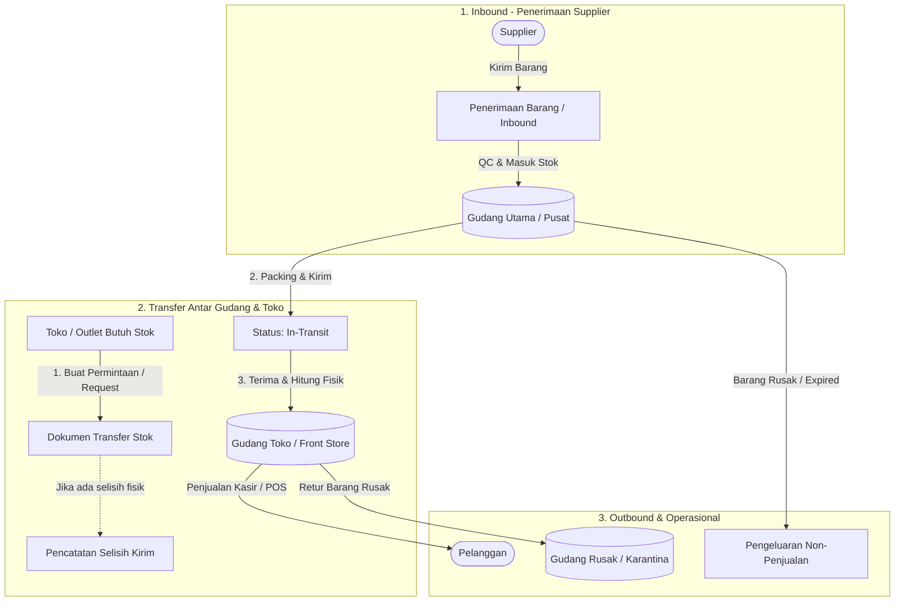

# Analisis & Rencana Arsitektur: Modul Gudang (Warehouse Management System)

Dokumen ini berisi analisis mendalam, perancangan arsitektur, skema database, alur proses bisnis, dan peta jalan implementasi untuk menambahkan **Modul Gudang (Warehouse Management System / WMS)** pada Bagus Management System (BMS).

---

## 1. Executive Summary & Analisis Kebutuhan

### 1.1 Kondisi Eksisting (Current State)
Saat ini BMS menggunakan model persediaan **Single-Location Inventory**:
1. **Master Barang & Stok Terpadu**: Tabel `inventory` menyimpan master data barang sekaligus kolom `stok` tunggal.
2. **Alur Pembelian Langsung**: Transaksi pembelian (`/purchasing`) langsung menambahkan angka pada `inventory.stok`.
3. **Alur Penjualan Langsung**: Transaksi kasir (POS) langsung memotong angka dari `inventory.stok`.
4. **Stok Opname Global**: Opname dilakukan untuk keseluruhan barang tanpa pemisahan lokasi fisik barang berada.

### 1.2 Masalah Operasional Tanpa Modul Gudang
* **Penyimpanan vs Pajangan**: Barang yang baru dibeli dalam jumlah besar dari supplier menumpuk di area gudang/penyimpanan belakang, namun sistem mencatat seluruhnya tersedia untuk dijual di etalase/rak kasir.
* **Kehilangan & Selisih Tidak Terlacak**: Sulit mengetahui apakah selisih barang hilang di etalase toko (pencurian/rusak) atau hilang saat masih di dalam gudang.
* **Tidak Ada Alur Transfer Formal**: Perpindahan barang dari gudang utama ke rak etalase toko (atau antar cabang) tidak memiliki dokumen serah-terima/bukti transfer resmi (Surat Jalan / Transfer Slip).
* **Barang Rusak & Kadaluarsa**: Pemusnahan barang rusak, barang sampel, atau barang retur belum memiliki pencatatan pengeluaran non-penjualan tersendiri di tingkat gudang.

### 1.3 Tujuan Penambahan Modul Gudang
1. Membagi persediaan menjadi **Multi-Lokasi / Multi-Gudang** (misal: *Gudang Pusat*, *Toko Utama/Front Store*, *Gudang Transit*, *Gudang Barang Rusak/Karantina*).
2. Menyediakan fitur **Transfer Stok Antar Gudang/Toko** dengan alur verifikasi (Request $\rightarrow$ Kirim / In-Transit $\rightarrow$ Terima / Verifikasi Selisih).
3. Mendukung **Inbound Receiving (Penerimaan Barang)** dari Supplier langsung ke Gudang Utama.
4. Mendukung **Outbound Non-Penjualan** (Scrap/Rusak, Sampel Promosi, Pemakaian Internal).
5. Menyediakan **Kartu Stok & Mutasi per Gudang** untuk akurasi audit log.
6. **Zero Breaking Changes**: Memastikan modul POS, Pembelian, Laporan, dan Kasir yang sudah ada tetap berjalan stabil selama masa transisi.

---

## 2. Pilihan Arsitektur Data Persediaan

| Aspek | Opsi A: Model Relasi `inventory_stocks` (Direkomendasikan) | Opsi B: Tabel Transaksi Gudang Terpisah |
| :--- | :--- | :--- |
| **Struktur** | `inventory` (master data katalog) + `inventory_stocks` (relasi Many-to-Many `inventory_id` $\times$ `gudang_id`). Kolom `inventory.stok` dipertahankan sebagai agregat otomatis (trigger/view) untuk backward compatibility. | Membuat tabel gudang terpisah yang berdiri sendiri tanpa relasi kuat ke `inventory`, stok dipelihara manual per entri. |
| **Dukungan Multi-Lokasi** | Skalabilitas tak terbatas (dapat menambah n-gudang, toko cabang, rak tanpa ubah skema). | Memerlukan sinkronisasi manual antar tabel berulang-ulang. |
| **Dampak ke Modul Lain** | Rendah. POS & Laporan eksisting tetap bisa membaca total stok atau diarahkan ke default store warehouse. | Tinggi. Semua query POS, penjualan, dan laporan harus ditulis ulang total. |
| **Integritas Data** | Terjamin dengan Foreign Key & Database Constraint unik `(inventory_id, gudang_id)`. | Rentan inkonsistensi saat terjadi network delay / konkurensi tinggi. |

> **Keputusan Arsitektur**: Menggunakan **Opsi A** dengan pendekatan *Gradual Rollout* (Pondasi tabel `inventory_stocks` dengan sinkronisasi trigger dua arah atau view agregat).

---

## 3. Alur Bisnis (Business Workflows)



### 3.1 Alur Penerimaan Barang (Inbound)
1. Pembelian dari supplier (`/purchasing`) dapat memilih lokasi gudang tujuan (default: *Gudang Pusat*).
2. Stok masuk langsung dialokasikan ke `inventory_stocks` pada gudang tersebut.
3. Dicatat di `stock_movements` dengan `gudang_id` terkait.

### 3.2 Alur Mutasi / Transfer Stok (Stock Transfer)
Alur transfer stok memiliki siklus hidup (state machine) 4 tahap untuk mencegah selisih stok silang:
1. **DRAFT / REQUESTED**: Staf toko meminta barang dari gudang.
2. **APPROVED / IN_TRANSIT**: Petugas gudang menyiapkan barang dan menekan *Kirim*. Stok Gudang Pusat berkurang, masuk ke status *In-Transit*.
3. **RECEIVED / COMPLETED**: Petugas toko menerima fisik barang, melakukan scanning barcode atau hitung manual, lalu menekan *Konfirmasi Terima*. Stok Toko bertambah.
4. **DISCREPANCY (Opsional)**: Jika barang yang diterima kurang dari yang dikirim (misal pecah di jalan), sistem mencatat selisih transfer untuk audit log.

### 3.3 Alur Pengeluaran Khusus (Outbound Non-Penjualan)
* **Kategori Pengeluaran**: Rusak/Pecah (*Damaged*), Kadaluarsa (*Expired*), Pemakaian Internal/Toko (*Internal Use*), Sampel Promosi (*Sample/Tester*), Hilang/Susut (*Loss*).
* Memotong stok dari gudang yang dipilih dan otomatis mencatat biaya terkait ke Buku Besar (`buku_besar` kategori pengeluaran operasional atau beban susut persediaan).

---

## 4. Perancangan Skema Database (Database Schema)

### 4.1 Tabel Master Gudang (`public.gudang`)
```sql
CREATE TYPE tipe_gudang AS ENUM (
    'PUSAT',      -- Gudang penyimpanan utama/grosir
    'TOKO',       -- Toko / Display etalase / Front Store
    'RETUR',      -- Karantina / Barang cacat / Retur supplier
    'TRANSIT'     -- Buffer perpindahan antar cabang
);

CREATE TABLE public.gudang (
    id UUID PRIMARY KEY DEFAULT gen_random_uuid(),
    kode_gudang TEXT NOT NULL UNIQUE, -- Contoh: 'GD-PST', 'TK-UTM', 'GD-RTR'
    nama TEXT NOT NULL,
    tipe tipe_gudang NOT NULL DEFAULT 'PUSAT',
    alamat TEXT,
    penanggung_jawab TEXT, -- Nama PIC
    kontak_pj TEXT,
    lokasi_kerja_id UUID REFERENCES public.lokasi_kerja(id) ON DELETE SET NULL, -- Integrasi lokasi fisik
    is_active BOOLEAN NOT NULL DEFAULT true,
    is_default BOOLEAN NOT NULL DEFAULT false, -- Gudang default penerimaan
    created_at TIMESTAMP WITH TIME ZONE DEFAULT NOW(),
    updated_at TIMESTAMP WITH TIME ZONE DEFAULT NOW()
);
```

### 4.2 Tabel Stok per Gudang (`public.inventory_stocks`)
```sql
CREATE TABLE public.inventory_stocks (
    id UUID PRIMARY KEY DEFAULT gen_random_uuid(),
    inventory_id UUID NOT NULL REFERENCES public.inventory(id) ON DELETE CASCADE,
    gudang_id UUID NOT NULL REFERENCES public.gudang(id) ON DELETE RESTRICT,
    stok INT NOT NULL DEFAULT 0 CHECK (stok >= 0),
    min_stok INT DEFAULT 0,
    max_stok INT,
    rak_lokasi TEXT, -- Contoh: 'Rak A-02-B', 'Bin 12'
    created_at TIMESTAMP WITH TIME ZONE DEFAULT NOW(),
    updated_at TIMESTAMP WITH TIME ZONE DEFAULT NOW(),
    CONSTRAINT uq_inventory_gudang UNIQUE (inventory_id, gudang_id)
);

CREATE INDEX idx_inv_stocks_inv ON public.inventory_stocks(inventory_id);
CREATE INDEX idx_inv_stocks_gudang ON public.inventory_stocks(gudang_id);
```

### 4.3 Tabel Transfer Stok Header & Items
```sql
CREATE TYPE status_transfer AS ENUM (
    'DRAFT',
    'REQUESTED',
    'APPROVED',
    'IN_TRANSIT',
    'RECEIVED',
    'REJECTED',
    'CANCELED'
);

CREATE TABLE public.transfer_stok (
    id UUID PRIMARY KEY DEFAULT gen_random_uuid(),
    nomor_transfer TEXT NOT NULL UNIQUE, -- Contoh: 'TRF/202608/0001'
    gudang_asal_id UUID NOT NULL REFERENCES public.gudang(id),
    gudang_tujuan_id UUID NOT NULL REFERENCES public.gudang(id),
    status status_transfer NOT NULL DEFAULT 'DRAFT',
    tanggal_kirim TIMESTAMP WITH TIME ZONE,
    tanggal_terima TIMESTAMP WITH TIME ZONE,
    kurir_pengirim TEXT,
    catatan TEXT,
    created_by UUID REFERENCES public.profiles(id),
    approved_by UUID REFERENCES public.profiles(id),
    received_by UUID REFERENCES public.profiles(id),
    created_at TIMESTAMP WITH TIME ZONE DEFAULT NOW(),
    updated_at TIMESTAMP WITH TIME ZONE DEFAULT NOW(),
    CONSTRAINT chk_gudang_berbeda CHECK (gudang_asal_id <> gudang_tujuan_id)
);

CREATE TABLE public.transfer_stok_items (
    id UUID PRIMARY KEY DEFAULT gen_random_uuid(),
    transfer_id UUID NOT NULL REFERENCES public.transfer_stok(id) ON DELETE CASCADE,
    inventory_id UUID NOT NULL REFERENCES public.inventory(id),
    qty_kirim INT NOT NULL CHECK (qty_kirim > 0),
    qty_terima INT DEFAULT 0 CHECK (qty_terima >= 0),
    catatan TEXT,
    created_at TIMESTAMP WITH TIME ZONE DEFAULT NOW(),
    CONSTRAINT uq_transfer_item UNIQUE (transfer_id, inventory_id)
);
```

### 4.4 Tabel Pengeluaran Non-Penjualan / Waste (`public.pengeluaran_gudang`)
```sql
CREATE TYPE tipe_pengeluaran_gudang AS ENUM (
    'RUSAK',
    'KADALUARSA',
    'PEMAKAIAN_SENDIRI',
    'SAMPEL_PROMOSI',
    'SELISIH_HILANG',
    'LAINNYA'
);

CREATE TABLE public.pengeluaran_gudang (
    id UUID PRIMARY KEY DEFAULT gen_random_uuid(),
    nomor_dokumen TEXT NOT NULL UNIQUE, -- Contoh: 'OUT-GD/202608/0001'
    gudang_id UUID NOT NULL REFERENCES public.gudang(id),
    tipe tipe_pengeluaran_gudang NOT NULL,
    tanggal DATE NOT NULL DEFAULT CURRENT_DATE,
    catatan TEXT,
    created_by UUID REFERENCES public.profiles(id),
    created_at TIMESTAMP WITH TIME ZONE DEFAULT NOW()
);

CREATE TABLE public.pengeluaran_gudang_items (
    id UUID PRIMARY KEY DEFAULT gen_random_uuid(),
    pengeluaran_id UUID NOT NULL REFERENCES public.pengeluaran_gudang(id) ON DELETE CASCADE,
    inventory_id UUID NOT NULL REFERENCES public.inventory(id),
    qty INT NOT NULL CHECK (qty > 0),
    harga_pokok NUMERIC NOT NULL DEFAULT 0,
    alasan TEXT,
    created_at TIMESTAMP WITH TIME ZONE DEFAULT NOW()
);
```

### 4.5 Penambahan Kolom di `stock_movements`
Menambahkan kolom `gudang_id` dan `gudang_tujuan_id` pada tabel `stock_movements` agar kartu stok dapat difilter per gudang.

---

## 5. Rencana Tampilan UI / UX & Struktur Menu

### 5.1 Penambahan Menu Sidebar
```typescript
const WAREHOUSE_ITEMS = [
  { href: '/warehouse', title: 'Ringkasan Gudang', icon: IconBuildingWarehouse },
  { href: '/warehouse/stocks', title: 'Stok per Gudang', icon: IconPackage },
  { href: '/warehouse/transfers', title: 'Mutasi & Transfer', icon: IconTruckDelivery },
  { href: '/warehouse/outbound', title: 'Pengeluaran Khusus', icon: IconTrashX },
  { href: '/warehouse/opname', title: 'Opname Gudang', icon: IconClipboardCheck },
  { href: '/warehouse/master', title: 'Master Gudang & Rak', icon: IconSettings },
];
```

### 5.2 Fitur Halaman Kunci
1. **Dashboard Gudang (`/warehouse`)**:
   * Ringkasan stok bernilai tinggi di gudang.
   * Notifikasi transfer pending yang butuh approval atau butuh konfirmasi penerimaan di toko.
   * Peringatan stok menipis per gudang (*Low Stock Warning by Warehouse*).
2. **Katalog Stok & Rak (`/warehouse/stocks`)**:
   * Filter dropdown gudang aktif (Semua Gudang, Gudang Pusat, Toko Utama).
   * Kolom lokasi rak (*Aisle/Bin Location*), stok minimum, dan tombol *Pindah Rak* atau *Transfer Cepat*.
   * Scan barcode instan untuk mencari posisi rak barang.
3. **Pusat Transfer Barang (`/warehouse/transfers`)**:
   * Form pembuatan transfer interaktif (mirip keranjang pembelian / POS).
   * Tombol cetak **Surat Jalan / Bukti Kirim Barang (PDF)**.
   * Mode Penerimaan Cepat (Scan Barcode saat barang tiba untuk auto-checklist item).
4. **Pengeluaran Non-Penjualan (`/warehouse/outbound`)**:
   * Pencatatan barang reject/kadaluarsa dengan upload foto bukti fisik dan kalkulasi total kerugian HPP.

---

## 6. Matriks Hak Akses (Role-Based Access Control)

| Modul / Tindakan | Kasir / Staf Toko | Staf Gudang | Kepala Gudang | Admin / Owner |
| :--- | :---: | :---: | :---: | :---: |
| **Lihat Stok Toko Sendiri** | ✅ | ✅ | ✅ | ✅ |
| **Lihat Stok Gudang Pusat** | 👁️ (Read Only) | ✅ | ✅ | ✅ |
| **Buat Request Transfer (Toko $\rightarrow$ Gudang)** | ✅ | ✅ | ✅ | ✅ |
| **Approve & Kirim Transfer dari Gudang** | ❌ | ✅ | ✅ | ✅ |
| **Konfirmasi Terima Barang di Toko** | ✅ | ❌ | ✅ | ✅ |
| **Input Barang Rusak / Kadaluarsa** | ❌ | ✅ (Draft) | ✅ (Approve) | ✅ |
| **Kelola Master Gudang & Lokasi Rak** | ❌ | ❌ | ✅ | ✅ |
| **Stok Opname Gudang** | ❌ | ✅ | ✅ | ✅ |

---

## 7. Rencana Tahapan Implementasi (Implementation Roadmap)

```
┌─────────────────────────────────────────────────────────────────────────────┐
│ TAHAP 1: Pondasi Database & Migrasi Data (Non-Breaking)                     │
│ - Buat ENUM, tabel `gudang`, `inventory_stocks`, `transfer_stok`, `outbound`│
│ - Seed gudang default ('Gudang Utama' & 'Toko Utama')                       │
│ - Migrasikan nilai `inventory.stok` saat ini menjadi stok di Gudang Utama   │
│ - Buat database trigger sinkronisasi otomatis                               │
└──────────────────────────────────────┬──────────────────────────────────────┘
                                       │
┌──────────────────────────────────────▼──────────────────────────────────────┐
│ TAHAP 2: Backend API & RPC Logic (Supabase Services)                        │
│ - RPC Transfer Kirim, Terima, dan Selisih Hitung                            │
│ - RPC Outbound Pengeluaran Khusus & Logging Mutasi                          │
│ - API Endpoints di `lib/api/warehouse.ts` & Typescript Types                │
└──────────────────────────────────────┬──────────────────────────────────────┘
                                       │
┌──────────────────────────────────────▼──────────────────────────────────────┐
│ TAHAP 3: Antarmuka UI/UX Modul Gudang                                       │
│ - Halaman Master Gudang & Rak (`/warehouse/master`)                         │
│ - Halaman Monitoring Stok Multi-Gudang (`/warehouse/stocks`)                │
│ - Halaman Pembuatan & Tracking Transfer Stok (`/warehouse/transfers`)       │
│ - Halaman Pengeluaran Barang Rusak / Non-Penjualan (`/warehouse/outbound`)  │
└──────────────────────────────────────┬──────────────────────────────────────┘
                                       │
┌──────────────────────────────────────▼──────────────────────────────────────┐
│ TAHAP 4: Integrasi Modul Lain & Cetak Dokumen                               │
│ - Hubungkan Modul Pembelian (`/purchasing`) untuk pilih Gudang Tujuan Masuk │
│ - Hubungkan Modul POS / Kasir ke Stok Gudang Toko                           │
│ - Generator PDF Surat Jalan Transfer & Berita Acara Barang Rusak            │
│ - Integrasi Jurnal Buku Besar untuk pengeluaran susut barang                │
└─────────────────────────────────────────────────────────────────────────────┘
```

---

## 8. Rekomendasi Langkah Selanjutnya

1. **Review & Persetujuan Desain**: Menyetujui skema database dan alur transfer stok yang diajukan.
2. **Penentuan Default Warehouse**: Menentukan nama dan kode gudang fisik yang saat ini beroperasi di lokasi bisnis.
3. **Eksekusi Tahap 1**: Menjalankan migrasi database via Supabase MCP tanpa mengganggu operasional sistem berjalan.
