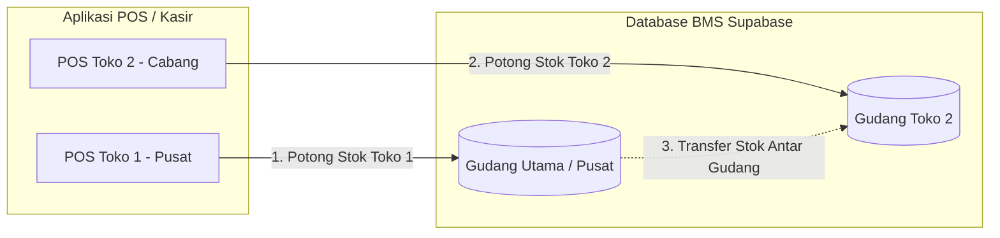

# Panduan Integrasi POS App: Multi-Gudang & Multi-Outlet

**Versi Dokumen**: 1.0.0  
**Target Pembaca**: Tim Pengembang Aplikasi POS (Point of Sale / Kasir)  
**Status**: Spesifikasi Resmi Integrasi Modul Gudang BMS  

---

## 1. Ringkasan Eksekutif & Konteks Perubahan

Bagus Management System (BMS) telah ditingkatkan dari model **Single-Location Inventory** menjadi sistem **Multi-Gudang & Multi-Outlet**. 

### 1.1 Topologi Operasional
1. **Toko 1 (Toko Pusat)**: Berada satu lokasi dengan Gudang Utama. Transaksi POS Toko Pusat langsung memotong stok dari **Gudang Utama / Pusat**.
2. **Toko 2 (Toko Cabang)**: Memiliki tempat penyimpanan terpisah (**Gudang Toko 2**). Transaksi POS Toko 2 memotong stok khusus dari **Gudang Toko 2**.
3. **Pasokan Stok Cabang**: Toko 2 menerima stok dari Gudang Utama melalui alur *Transfer Stok & Surat Jalan*.



---

## 2. Poin Perubahan Kunci untuk Tim POS

| Aspek | Implementasi Lama | Implementasi Baru (Multi-Gudang) |
| :--- | :--- | :--- |
| **Sumber Data Stok** | Membaca langsung kolom `stok` di tabel `public.inventory`. | Membaca stok dari tabel `public.inventory_stocks` sesuai `gudang_id` aktif di toko tersebut. |
| **Payload Transaksi Penjualan** | Hanya mengirim item (`inventory_id`, `qty`, `harga_jual`). | Wajib menyertakan parameter `gudang_id` (atau terikat ke shift aktif kasir). |
| **Validasi Stok Kasir** | Cek stok global. | Cek stok fisik spesifik pada gudang toko tempat transaksi berlangsung. |
| **Retur Penjualan** | Stok retur kembali ke pool global. | Stok retur masuk kembali ke gudang toko terkait (atau dialokasikan ke gudang barang cacat). |

---

## 3. Identifikasi Gudang & Manajemen Shift Kasir

### 3.1 Penentuan Gudang Aktif di POS
Aplikasi POS harus mengetahui di outlet/gudang mana aplikasi sedang beroperasi. Terdapat dua metode yang didukung:

#### Metode A: Ikat pada Buka Shift Kasir (Direkomendasikan)
Saat kasir melakukan **Buka Shift** (`shift_sessions`), kasir memilih atau mengonfirmasi lokasi outlet/gudang tempat bertugas:
* Kolom baru pada `public.shift_sessions`: `gudang_id UUID REFERENCES public.gudang(id)`.
* Seluruh transaksi penjualan yang terjadi selama shift tersebut otomatis menginduk ke `gudang_id` shift aktif.

#### Metode B: Konfigurasi Perangkat (Device Setting)
Di menu *Pengaturan Aplikasi POS*, supervisor menyetel `gudang_id` default untuk tablet/device kasir tersebut.

---

## 4. Spesifikasi API & Query Database

### 4.1 Mendapatkan Daftar Gudang / Outlet Aktif
Digunakan saat inisialisasi aplikasi atau pemilihan toko saat buka shift.

**Query (Supabase SDK):**
```typescript
const { data: gudangList, error } = await supabase
  .from('gudang')
  .select('id, kode_gudang, nama, tipe, alamat, is_default')
  .eq('is_active', true)
  .order('nama', { ascending: true });
```

**Contoh Response Data:**
```json
[
  {
    "id": "11111111-1111-1111-1111-111111111111",
    "kode_gudang": "GD-PST",
    "nama": "Gudang Utama & Toko Pusat",
    "tipe": "PUSAT",
    "alamat": "Jl. Utama No. 1",
    "is_default": true
  },
  {
    "id": "22222222-2222-2222-2222-222222222222",
    "kode_gudang": "TK-CB2",
    "nama": "Gudang Toko 2 (Cabang)",
    "tipe": "CABANG",
    "alamat": "Jl. Cabang No. 88",
    "is_default": false
  }
]
```

---

### 4.2 Mengambil Katalog Barang & Stok Sesuai Gudang Toko
Gunakan query join ke `inventory_stocks` untuk menampilkan stok riil toko yang bersangkutan.

**Query (Supabase SDK):**
```typescript
const activeGudangId = "22222222-2222-2222-2222-222222222222"; // ID Toko 2

const { data: items, error } = await supabase
  .from('inventory')
  .select(`
    id,
    nama_barang,
    kode_barcode,
    harga_jual,
    diskon,
    unit,
    is_discontinued,
    id_kategori ( id, nama ),
    inventory_stocks!inner (
      stok,
      min_stok,
      rak_lokasi
    )
  `)
  .eq('is_discontinued', false)
  .eq('inventory_stocks.gudang_id', activeGudangId);
```

> **Catatan Parsing**: Nilai stok untuk kasir diambil dari `item.inventory_stocks[0]?.stok ?? 0`.

---

### 4.3 Mengirim Transaksi Penjualan (Checkout POS)

Saat kasir menekan tombol bayar / selesai, payload yang dikirimkan ke RPC penjualan harus menyertakan `gudang_id`.

**Eksekusi RPC (Supabase SDK):**
```typescript
const payload = {
  p_user: currentUserId,
  p_gudang_id: activeGudangId, // UUID Gudang Toko
  p_shift_id: activeShiftId,   // UUID Shift Aktif
  p_items: [
    {
      inventory_id: "a1b2c3d4-...",
      nama_barang: "Barang A",
      qty: 2,
      harga_jual: 50000,
      diskon: 0,
      harga_final: 50000,
      cost_at_sale: 35000
    }
  ],
  p_metode_bayar: "CASH",
  p_nominal_bayar: 100000,
  p_member_id: null
};

const { data: transaksiId, error } = await supabase.rpc('create_penjualan_v2', payload);
```

#### Mekanisme Validasi di Level Database:
1. Database memeriksa ketersediaan stok di `inventory_stocks` untuk `(inventory_id, activeGudangId)`.
2. Jika `stok < qty`, database melempar exception: `"Stok di gudang toko tidak mencukupi"`.
3. Jika stok cukup, sistem otomatis:
   * Mengurangi `inventory_stocks.stok`.
   * Menambahkan entri pada `stock_movements` dengan kolom `gudang_id = activeGudangId`.
   * Mencatat transaksi di tabel `penjualan` dan `penjualan_items`.

---

### 4.4 Cek Stok Realtime Antar Cabang (Cross-Outlet Stock Lookup)
Fitur pendukung kasir: Jika stok di Toko 2 habis, kasir dapat melihat ketersediaan barang tersebut di Toko Pusat/Gudang Utama untuk menginformasikan ke pelanggan.

**Query (Supabase SDK):**
```typescript
async function checkStockAllBranches(inventoryId: string) {
  const { data, error } = await supabase
    .from('inventory_stocks')
    .select(`
      stok,
      rak_lokasi,
      gudang:gudang_id (
        id,
        nama,
        kode_gudang,
        tipe
      )
    `)
    .eq('inventory_id', inventoryId);

  return data; // Menampilkan stok di Gudang Pusat vs Toko 2
}
```

---

## 5. Alur Retur Penjualan (Sales Return)

Saat pelanggan melakukan retur di Toko 2:
1. Kasir memilih apakah barang retur:
   * **Kondisi Baik (Layak Jual)** $\rightarrow$ Dikembalikan ke stok **Gudang Toko 2**.
   * **Kondisi Rusak (Reject/Cacat)** $\rightarrow$ Dialokasikan ke **Gudang Retur/Karantina** atau dicatat sebagai barang rusak agar tidak bisa dijual kembali ke pelanggan lain.

**Payload RPC Retur Penjualan:**
```typescript
const returnPayload = {
  p_penjualan_id: "transaksi-uuid",
  p_gudang_id: activeGudangId, // Gudang penerima barang retur
  p_items: [
    {
      inventory_id: "a1b2c3d4-...",
      qty: 1,
      kondisi: "BAIK", // 'BAIK' | 'RUSAK'
      alasan: "Salah ukuran"
    }
  ]
};

const { data, error } = await supabase.rpc('process_penjualan_return', returnPayload);
```

---

## 6. Backward Compatibility & Fallback Rule

Untuk mencegah error jika aplikasi POS belum sempat diupdate serentak di semua perangkat:
1. **Default Fallback**: Jika parameter `gudang_id` tidak dikirimkan oleh POS App versi lama, RPC backend secara otomatis akan menggunakan `gudang_id` yang bertanda `is_default = true` (yaitu **Gudang Utama & Toko Pusat**).
2. **Backward Sync**: Nilai kolom `stok` pada tabel induk `public.inventory` tetap disinkronkan otomatis via Database Trigger sebagai total agregat seluruh gudang.

---

## 7. Checklist Implementasi Tim POS

- [ ] Tambahkan konfigurasi `gudang_id` pada sesi kasir / formulir buka shift.
- [ ] Ubah query fetch produk agar menyertakan join `inventory_stocks` sesuai `gudang_id` toko aktif.
- [ ] Tambahkan parameter `gudang_id` pada payload checkout transaksi penjualan.
- [ ] Tambahkan informasi nama outlet/gudang aktif pada header struk kasir (*receipt*).
- [ ] (Opsional) Tambahkan fitur *Cross-Branch Stock Check* pada detail produk kasir.
- [ ] Uji skenario transaksi di Toko 1 (stok Gudang Utama berkurang) dan Toko 2 (stok Gudang Toko 2 berkurang).
