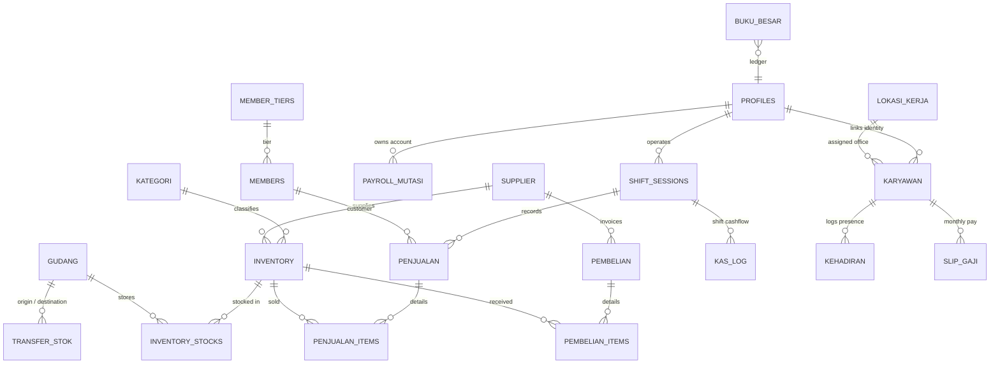
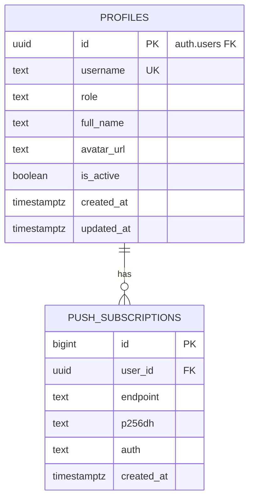
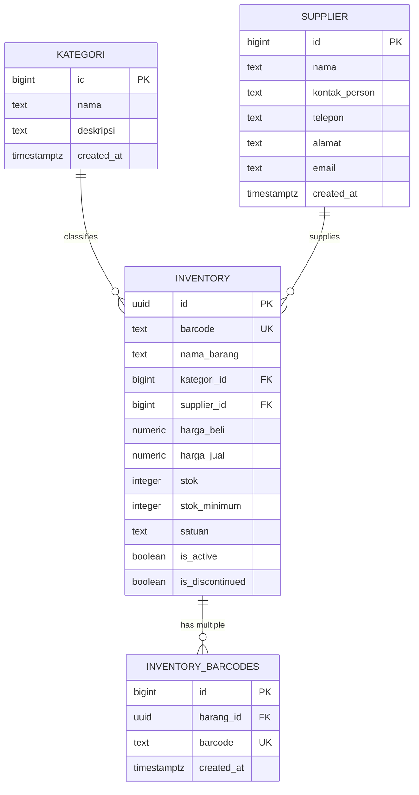
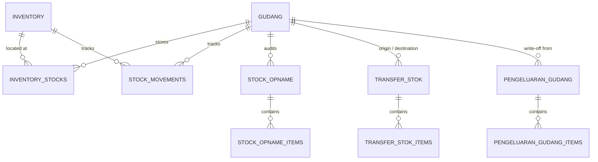
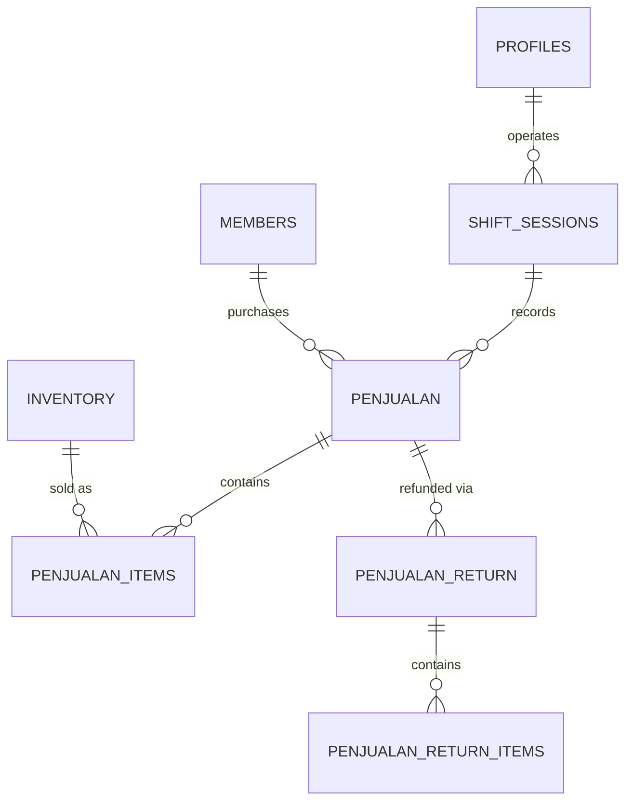
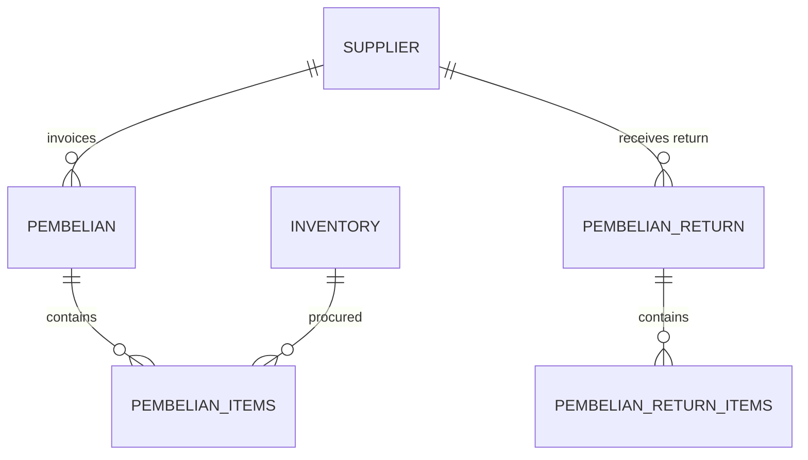
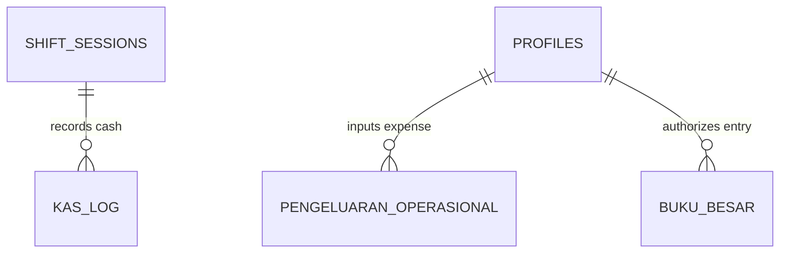
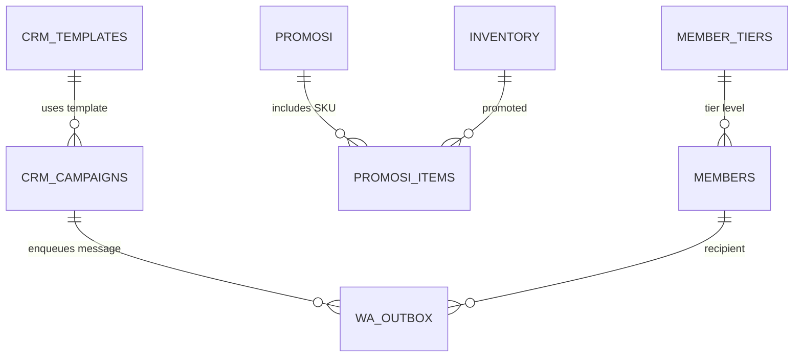
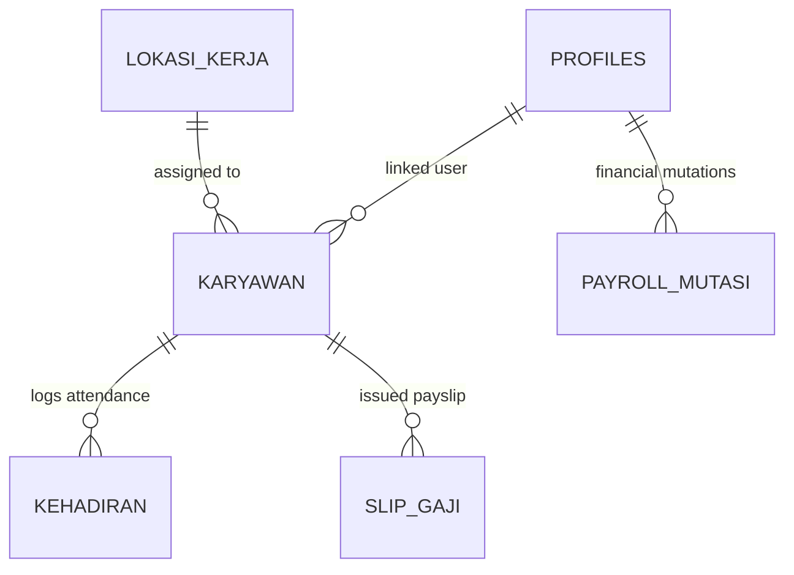
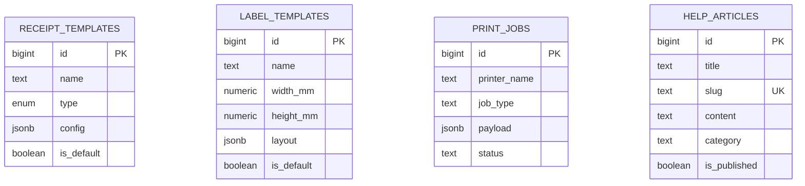

# Dokumentasi Skema Database (Single Source of Truth)
## BMS Inventory & Point of Sale System

> **Database Engine**: PostgreSQL 17.6 (Supabase Managed Database)  
> **Status Skema**: Live & Production Ready  
> **Terakhir Diperbarui**: September 2026  
> **Dokumen Versi**: 1.0.0  
> **Cakupan**: 44 Tabel Base, 3 Analytical Views, 9 Custom Enums, Stored Procedures (RPC), Triggers, Indexing, dan RLS Security Matrix.

---

## Daftar Isi (Table of Contents)

1. [Ringkasan Eksekutif & Arsitektur Database](#1-ringkasan-eksekutif--arsitektur-database)
   - [Master Entity Relationship Diagram (High-Level)](#master-entity-relationship-diagram-high-level)
   - [Ekstensi Database Aktif](#ekstensi-database-aktif)
2. [Data Dictionary & Spesifikasi Skema per Domain](#2-data-dictionary--spesifikasi-skema-per-domain)
   - [Domain 1: User Management, Roles & Auth](#domain-1-user-management-roles--authentication)
   - [Domain 2: Master Data & Katalog Barang](#domain-2-master-data--katalog-barang)
   - [Domain 3: Multi-Gudang, Stok & Distribusi Logistik](#domain-3-multi-gudang-stok--distribusi-logistik)
   - [Domain 4: Point of Sale (POS) & Transaksi Kasir](#domain-4-point-of-sale-pos--transaksi-kasir)
   - [Domain 5: Pengadaan & Purchasing](#domain-5-pengadaan--purchasing)
   - [Domain 6: Kas, Operasional & Akuntansi (Ledger)](#domain-6-kas-operasional--akuntansi-ledger)
   - [Domain 7: Loyalty, Membership & CRM](#domain-7-loyalty-membership--crm)
   - [Domain 8: Payroll, Karyawan & Manajemen SDM](#domain-8-payroll-karyawan--manajemen-sdm)
   - [Domain 9: Utility, Cetak & Sistem](#domain-9-utility-cetak--sistem)
3. [Database Views & Analytical Objects](#3-database-views--analytical-objects)
4. [Katalog Custom Enum Types](#4-katalog-custom-enum-types)
5. [Katalog Stored Procedures (RPC) & Functions](#5-katalog-stored-procedures-rpc--functions)
6. [Matriks Row Level Security (RLS) & Keamanan](#6-matriks-row-level-security-rls--keamanan)
7. [Pedoman & Konvensi Pengembangan Masa Depan](#7-pedoman--konvensi-pengembangan-masa-depan)

---

## 1. Ringkasan Eksekutif & Arsitektur Database

Sistem Database BMS Inventory dirancang menggunakan prinsip **Domain-Driven Architecture** dan **Event-Driven Audit Trails**. Seluruh mutasi persediaan barang dan keuangan tidak dimodifikasi secara langsung (in-place modification tanpa jejak), melainkan melalui mekanisme **Append-Only Movement & Ledger** yang divalidasi oleh Trigger dan Stored Procedures tingkat database.

### Prinsip Utama Desain Skema:
1. **Multi-Warehouse Isolation**: Stok fisik dikelola per lokasi (`inventory_stocks`) dengan sinkronisasi otomatis ke total agregat master barang (`inventory`).
2. **Double/Single-Entry General Ledger**: Setiap aktivitas finansial (penjualan shift, faktur pembelian, biaya operasional, kasbon) otomatis bermuara ke `buku_besar` melalui database triggers.
3. **Multi-Stage Logistics Transfer**: Pemindahan stok antar gudang mengadopsi mesin status 7 tahap (`DRAFT` -> `REQUESTED` -> `APPROVED` -> `IN_TRANSIT` -> `RECEIVED`) untuk mencegah selisih barang dalam perjalanan.
4. **Resilient POS & Void per Item**: Transaksi penjualan kasir mendukung pembatalan transaksi penuh (void nota) maupun pembatalan parsial per item (`is_void`) dengan pengembalian stok otomatis.
5. **Zero Trust & Row Level Security**: 100% tabel database memvalidasi hak akses menggunakan PostgreSQL Row Level Security (RLS) berbasis Role JWT Supabase (`superadmin`, `admin`, `cashier`, `finance`).

---

### Master Entity Relationship Diagram (High-Level)



---

### Ekstensi Database Aktif

| Ekstensi | Versi Terpasang | Deskripsi & Tujuan Penggunaan |
| :--- | :--- | :--- |
| **`pg_trgm`** | 1.4+ | Trigram matching untuk mendukung fitur **Fuzzy Text Search** pada nama barang, barcode, dan nama supplier. |
| **`uuid-ossp`** / **`pgcrypto`** | Core | Pembangkitan UUID v4 acak untuk Primary Key tabel transaksi & profil. |
| **`pg_net`** | 0.9+ | Fitur HTTP asynchronous request dari PostgreSQL (digunakan untuk webhook notifikasi / WhatsApp trigger). |
| **`btree_gist`** | 1.7+ | Indeks GiST untuk integritas query temporal / geolokasi. |

---

## 2. Data Dictionary & Spesifikasi Skema per Domain


---

### Domain 1: User Management, Roles & Authentication

> **Deskripsi Domain**: Mengelola identitas pengguna, hak akses peran (RBAC: `superadmin`, `admin`, `cashier`, `finance`), profil kasir/admin yang terhubung ke `auth.users`, dan langganan Web Push Notification.

#### Entity Relationship Diagram (Domain 1)



#### Tabel: `public.profiles`

**Fungsi Bisnis**: Menyimpan data profil pengguna sistem yang terhubung langsung dengan Supabase Auth (auth.users), mencakup username, nama lengkap, avatar, dan role otorisasi (superadmin, admin, cashier, finance).

| No | Nama Kolom | Tipe Data | Nullable | Nilai Default | Keterangan & Aturan Bisnis |
| :--- | :--- | :--- | :---: | :--- | :--- |
| 1 | **`id`** | `uuid` | **`NOT NULL`** | - | UUID identitas pengguna, bereferensi 1-to-1 dengan `auth.users.id`. |
| 2 | **`nama`** | `text` | `NULL` | - | Menyimpan data nama. |
| 4 | **`created_at`** | `timestamp` | `NULL` | `now()` | Timestamp saat baris data pertama kali dibuat. |
| 5 | **`username`** | `text` | `NULL` | - | Username unik untuk login dan identitas sistem. |
| 6 | **`avatar_url`** | `text` | `NULL` | - | URL foto avatar profil pengguna. |
| 7 | **`email`** | `text` | `NULL` | - | Menyimpan data email. |
| 8 | **`last_sign_in_at`** | `timestamptz` | `NULL` | - | Menyimpan data last sign in at. |
| 9 | **`roles`** | `_text` | `NULL` | `ARRAY['kasir', 'staff_gudang']` | Menyimpan data roles. |
| 10 | **`default_gudang_id`** | `uuid` | `NULL` | - | Foreign key referensi ke relasi default_gudang. |

**Constraints & Indeks Utama**:
- **Primary Key**: `id`
- **Unique Constraint**: `username` (`profiles_username_key`)
- **Foreign Keys**:
  - `default_gudang_id` $\rightarrow$ `gudang.id` (ON DELETE: `SET NULL`, ON UPDATE: `NO ACTION`)
- **Indeks Terpasang** (4 index):
  - `idx_profiles_default_gudang`: `idx_profiles_default_gudang ON public.profiles USING btree (default_gudang_id)`
  - `idx_profiles_roles`: `idx_profiles_roles ON public.profiles USING gin (roles)`
  - `profiles_pkey`: `UNIQUE: profiles_pkey ON public.profiles USING btree (id)`
  - `profiles_username_key`: `UNIQUE: profiles_username_key ON public.profiles USING btree (username)`
- **Database Triggers**:
  - **`set_audit_profiles`**: `BEFORE INSERT` $\rightarrow$ `set_audit_simple_created_at()`
  - **`set_audit_profiles`**: `BEFORE UPDATE` $\rightarrow$ `set_audit_simple_created_at()`
- **Row Level Security (RLS)**: Ditransformasikan dengan **3 Kebijakan Keamanan (Policies)**.

#### Tabel: `public.push_subscriptions`

**Fungsi Bisnis**: Menyimpan endpoint dan kredensial enkripsi Web Push Notification browser untuk setiap pengguna.

| No | Nama Kolom | Tipe Data | Nullable | Nilai Default | Keterangan & Aturan Bisnis |
| :--- | :--- | :--- | :---: | :--- | :--- |
| 1 | **`id`** | `uuid` | **`NOT NULL`** | `gen_random_uuid()` | Primary Key unik rekaman. |
| 2 | **`user_id`** | `uuid` | **`NOT NULL`** | - | UUID pengguna penerima notifikasi (FK `profiles.id`). |
| 3 | **`endpoint`** | `text` | **`NOT NULL`** | - | Endpoint URL browser web push service. |
| 4 | **`auth_key`** | `text` | **`NOT NULL`** | - | Menyimpan data auth key. |
| 5 | **`p256dh_key`** | `text` | **`NOT NULL`** | - | Menyimpan data p256dh key. |
| 6 | **`created_at`** | `timestamptz` | `NULL` | `now()` | Timestamp saat baris data pertama kali dibuat. |
| 7 | **`updated_at`** | `timestamptz` | `NULL` | `now()` | Timestamp saat baris data terakhir kali diperbarui. |

**Constraints & Indeks Utama**:
- **Primary Key**: `id`
- **Unique Constraint**: `endpoint` (`push_subscriptions_endpoint_key`)
- **Indeks Terpasang** (3 index):
  - `idx_push_subscriptions_user_id`: `idx_push_subscriptions_user_id ON public.push_subscriptions USING btree (user_id)`
  - `push_subscriptions_endpoint_key`: `UNIQUE: push_subscriptions_endpoint_key ON public.push_subscriptions USING btree (endpoint)`
  - `push_subscriptions_pkey`: `UNIQUE: push_subscriptions_pkey ON public.push_subscriptions USING btree (id)`
- **Database Triggers**: *(Tidak ada trigger khusus)*
- **Row Level Security (RLS)**: Ditransformasikan dengan **1 Kebijakan Keamanan (Policies)**.


---

### Domain 2: Master Data & Katalog Barang

> **Deskripsi Domain**: Pusat master data katalog barang: kategori produk, pemasok (supplier), master inventaris barang, kode barcode utama, status aktif/discontinued, serta multi-barcode per SKU.

#### Entity Relationship Diagram (Domain 2)



#### Tabel: `public.kategori`

**Fungsi Bisnis**: Master kategori produk/barang dagangan untuk klasifikasi katalog dan pelaporan analitik penjualan.

| No | Nama Kolom | Tipe Data | Nullable | Nilai Default | Keterangan & Aturan Bisnis |
| :--- | :--- | :--- | :---: | :--- | :--- |
| 1 | **`id`** | `uuid` | **`NOT NULL`** | `gen_random_uuid()` | Identifier unik kategori produk. |
| 2 | **`nama`** | `text` | **`NOT NULL`** | - | Nama kategori produk (misal: 'Minuman', 'Makanan Ringan', 'Elektronik'). |
| 3 | **`created_at`** | `timestamp` | `NULL` | `now()` | Timestamp saat baris data pertama kali dibuat. |

**Constraints & Indeks Utama**:
- **Primary Key**: `id`
- **Unique Constraint**: `nama` (`kategori_nama_unique`)
- **Unique Constraint**: `nama` (`kategori_nama_key`)
- **Indeks Terpasang** (3 index):
  - `kategori_nama_key`: `UNIQUE: kategori_nama_key ON public.kategori USING btree (nama)`
  - `kategori_nama_unique`: `UNIQUE: kategori_nama_unique ON public.kategori USING btree (nama)`
  - `kategori_pkey`: `UNIQUE: kategori_pkey ON public.kategori USING btree (id)`
- **Database Triggers**:
  - **`set_audit_kategori`**: `BEFORE INSERT` $\rightarrow$ `set_audit_simple_created_at()`
  - **`set_audit_kategori`**: `BEFORE UPDATE` $\rightarrow$ `set_audit_simple_created_at()`
- **Row Level Security (RLS)**: Ditransformasikan dengan **3 Kebijakan Keamanan (Policies)**.

#### Tabel: `public.supplier`

**Fungsi Bisnis**: Master data vendor/pemasok barang pengadaan (nama, kontak, telepon, alamat).

| No | Nama Kolom | Tipe Data | Nullable | Nilai Default | Keterangan & Aturan Bisnis |
| :--- | :--- | :--- | :---: | :--- | :--- |
| 1 | **`id`** | `uuid` | **`NOT NULL`** | `gen_random_uuid()` | Identifier unik pemasok. |
| 2 | **`nama`** | `text` | **`NOT NULL`** | - | Nama perusahaan / vendor pemasok. |
| 3 | **`kontak`** | `text` | `NULL` | - | Menyimpan data kontak. |
| 4 | **`alamat`** | `text` | `NULL` | - | Alamat fisik gudang/kantor pemasok. |
| 5 | **`created_at`** | `timestamp` | `NULL` | `now()` | Timestamp saat baris data pertama kali dibuat. |

**Constraints & Indeks Utama**:
- **Primary Key**: `id`
- **Unique Constraint**: `nama` (`supplier_nama_key`)
- **Indeks Terpasang** (2 index):
  - `supplier_nama_key`: `UNIQUE: supplier_nama_key ON public.supplier USING btree (nama)`
  - `supplier_pkey`: `UNIQUE: supplier_pkey ON public.supplier USING btree (id)`
- **Database Triggers**:
  - **`set_audit_supplier`**: `BEFORE INSERT` $\rightarrow$ `set_audit_simple_created_at()`
  - **`set_audit_supplier`**: `BEFORE UPDATE` $\rightarrow$ `set_audit_simple_created_at()`
- **Row Level Security (RLS)**: Ditransformasikan dengan **4 Kebijakan Keamanan (Policies)**.

#### Tabel: `public.inventory`

**Fungsi Bisnis**: Master data katalog produk/barang, memuat kode barcode utama, harga beli (HPP), harga jual, stok agregat, stok minimum, serta status aktif/discontinued.

| No | Nama Kolom | Tipe Data | Nullable | Nilai Default | Keterangan & Aturan Bisnis |
| :--- | :--- | :--- | :---: | :--- | :--- |
| 1 | **`id`** | `uuid` | **`NOT NULL`** | `gen_random_uuid()` | Identifier unik produk (UUID). |
| 2 | **`nama_barang`** | `text` | **`NOT NULL`** | - | Nama lengkap produk / SKU. |
| 3 | **`slug`** | `text` | `NULL` | - | Menyimpan data slug. |
| 4 | **`kode_barcode`** | `text` | **`NOT NULL`** | - | Menyimpan data kode barcode. |
| 5 | **`harga_beli_terakhir`** | `numeric` | `NULL` | - | Menyimpan data harga beli terakhir. |
| 6 | **`harga_jual`** | `numeric` | **`NOT NULL`** | - | Harga jual standar ke konsumen di kasir. |
| 7 | **`stok`** | `int4` | `NULL` | `0` | Total stok barang teragregasi di seluruh gudang (tersinkronisasi via trigger). |
| 8 | **`id_kategori`** | `uuid` | `NULL` | - | Menyimpan data id kategori. |
| 9 | **`created_by`** | `uuid` | `NULL` | - | UUID user pembuat rekaman (FK `profiles.id`). |
| 10 | **`created_at`** | `timestamp` | `NULL` | `now()` | Timestamp saat baris data pertama kali dibuat. |
| 11 | **`updated_at`** | `timestamp` | `NULL` | `now()` | Timestamp saat baris data terakhir kali diperbarui. |
| 12 | **`minimum_stock`** | `int4` | `NULL` | - | Menyimpan data minimum stock. |
| 13 | **`unit`** | `text` | `NULL` | `'pcs'` | Menyimpan data unit. |
| 14 | **`diskon`** | `numeric` | `NULL` | `0` | Menyimpan data diskon. |
| 15 | **`updated_by`** | `uuid` | `NULL` | - | Menyimpan data updated by. |
| 16 | **`is_discontinued`** | `bool` | `NULL` | `false` | Flag penanda barang sudah tidak diproduksi / arsip (tidak muncul di pencarian aktif kasir). |
| 17 | **`discontinued_at`** | `timestamp` | `NULL` | - | Menyimpan data discontinued at. |
| 18 | **`discontinued_by`** | `uuid` | `NULL` | - | Menyimpan data discontinued by. |
| 19 | **`snoozed_until`** | `timestamptz` | `NULL` | - | Menyimpan data snoozed until. |

**Constraints & Indeks Utama**:
- **Primary Key**: `id`
- **Unique Constraint**: `slug` (`unique_slug`)
- **Unique Constraint**: `nama_barang` (`inventory_nama_barang_unique`)
- **Foreign Keys**:
  - `created_by` $\rightarrow$ `profiles.id` (ON DELETE: `NO ACTION`, ON UPDATE: `NO ACTION`)
  - `discontinued_by` $\rightarrow$ `profiles.id` (ON DELETE: `NO ACTION`, ON UPDATE: `NO ACTION`)
  - `id_kategori` $\rightarrow$ `kategori.id` (ON DELETE: `NO ACTION`, ON UPDATE: `NO ACTION`)
- **Indeks Terpasang** (12 index):
  - `idx_inventory_barcode`: `idx_inventory_barcode ON public.inventory USING btree (kode_barcode)`
  - `idx_inventory_created_by`: `idx_inventory_created_by ON public.inventory USING btree (created_by)`
  - `idx_inventory_discontinued_by`: `idx_inventory_discontinued_by ON public.inventory USING btree (discontinued_by)`
  - `idx_inventory_id_kategori`: `idx_inventory_id_kategori ON public.inventory USING btree (id_kategori)`
  - `idx_inventory_is_discontinued`: `idx_inventory_is_discontinued ON public.inventory USING btree (is_discontinued)`
  - `idx_inventory_kode_barcode`: `idx_inventory_kode_barcode ON public.inventory USING btree (kode_barcode)`
  - `idx_inventory_nama`: `idx_inventory_nama ON public.inventory USING gin (nama_barang gin_trgm_ops)`
  - `idx_inventory_nama_barang`: `idx_inventory_nama_barang ON public.inventory USING btree (nama_barang)`
  - `idx_inventory_slug`: `idx_inventory_slug ON public.inventory USING btree (slug)`
  - `inventory_nama_barang_unique`: `UNIQUE: inventory_nama_barang_unique ON public.inventory USING btree (nama_barang)`
  - `inventory_pkey`: `UNIQUE: inventory_pkey ON public.inventory USING btree (id)`
  - `unique_slug`: `UNIQUE: unique_slug ON public.inventory USING btree (slug)`
- **Database Triggers**:
  - **`inventory_set_updated`**: `BEFORE UPDATE` $\rightarrow$ `set_updated_at_and_by()`
  - **`set_audit_inventory`**: `BEFORE UPDATE` $\rightarrow$ `set_audit_inventory()`
  - **`set_audit_inventory`**: `BEFORE INSERT` $\rightarrow$ `set_audit_inventory()`
- **Row Level Security (RLS)**: Ditransformasikan dengan **5 Kebijakan Keamanan (Policies)**.

#### Tabel: `public.inventory_barcodes`

**Fungsi Bisnis**: Menampung barcode sekunder/tambahan per produk untuk mendukung barang dengan banyak varian kemasan atau barcode vendor berbeda.

| No | Nama Kolom | Tipe Data | Nullable | Nilai Default | Keterangan & Aturan Bisnis |
| :--- | :--- | :--- | :---: | :--- | :--- |
| 1 | **`id`** | `uuid` | **`NOT NULL`** | `gen_random_uuid()` | Identifier unik barcode sekunder. |
| 2 | **`inventory_id`** | `uuid` | `NULL` | - | Foreign key referensi ke relasi inventory. |
| 3 | **`barcode`** | `text` | **`NOT NULL`** | - | Kode barcode alternatif/sekunder. |
| 4 | **`is_primary`** | `bool` | `NULL` | `true` | Menyimpan data is primary. |
| 5 | **`created_at`** | `timestamp` | `NULL` | `now()` | Timestamp saat baris data pertama kali dibuat. |

**Constraints & Indeks Utama**:
- **Primary Key**: `id`
- **Unique Constraint**: `barcode` (`inventory_barcodes_barcode_key`)
- **Unique Constraint**: `barcode` (`inventory_barcodes_barcode_unique`)
- **Foreign Keys**:
  - `inventory_id` $\rightarrow$ `inventory.id` (ON DELETE: `CASCADE`, ON UPDATE: `NO ACTION`)
- **Indeks Terpasang** (5 index):
  - `idx_inventory_barcodes_barcode`: `idx_inventory_barcodes_barcode ON public.inventory_barcodes USING btree (barcode)`
  - `idx_inventory_barcodes_inventory_id`: `idx_inventory_barcodes_inventory_id ON public.inventory_barcodes USING btree (inventory_id)`
  - `inventory_barcodes_barcode_key`: `UNIQUE: inventory_barcodes_barcode_key ON public.inventory_barcodes USING btree (barcode)`
  - `inventory_barcodes_barcode_unique`: `UNIQUE: inventory_barcodes_barcode_unique ON public.inventory_barcodes USING btree (barcode)`
  - `inventory_barcodes_pkey`: `UNIQUE: inventory_barcodes_pkey ON public.inventory_barcodes USING btree (id)`
- **Database Triggers**: *(Tidak ada trigger khusus)*
- **Row Level Security (RLS)**: Ditransformasikan dengan **4 Kebijakan Keamanan (Policies)**.


---

### Domain 3: Multi-Gudang, Stok & Distribusi Logistik

> **Deskripsi Domain**: Arsitektur multi-lokasi gudang/toko, stok fisik per gudang, buku audit mutasi stok (append-only ledger), stok opname fisik berkala, penyesuaian stok darurat, alur transfer bertahap antar gudang, dan penghapusan barang rusak/kadaluarsa (write-off).

#### Entity Relationship Diagram (Domain 3)



#### Tabel: `public.gudang`

**Fungsi Bisnis**: Master lokasi fisik penyimpanan stok (Toko Utama, Gudang Transit, Gudang Retur, Cabang).

| No | Nama Kolom | Tipe Data | Nullable | Nilai Default | Keterangan & Aturan Bisnis |
| :--- | :--- | :--- | :---: | :--- | :--- |
| 1 | **`id`** | `uuid` | **`NOT NULL`** | `gen_random_uuid()` | Identifier unik gudang (UUID). |
| 2 | **`kode_gudang`** | `text` | **`NOT NULL`** | - | Menyimpan data kode gudang. |
| 3 | **`nama`** | `text` | **`NOT NULL`** | - | Nama lokasi gudang/outlet. |
| 4 | **`tipe`** | `tipe_gudang` | **`NOT NULL`** | `'PUSAT'` | Tipe gudang: `'PUSAT'`, `'CABANG'`, `'RETUR'`, `'TRANSIT'` (enum `tipe_gudang`). |
| 5 | **`alamat`** | `text` | `NULL` | - | Alamat fisik lokasi gudang. |
| 6 | **`penanggung_jawab`** | `text` | `NULL` | - | Menyimpan data penanggung jawab. |
| 7 | **`kontak_pj`** | `text` | `NULL` | - | Menyimpan data kontak pj. |
| 8 | **`lokasi_kerja_id`** | `uuid` | `NULL` | - | Foreign key referensi ke relasi lokasi_kerja. |
| 9 | **`is_active`** | `bool` | **`NOT NULL`** | `true` | Status operasional gudang. |
| 10 | **`is_default`** | `bool` | **`NOT NULL`** | `false` | Penanda apakah lokasi ini merupakan gudang/toko utama default. |
| 11 | **`created_at`** | `timestamptz` | **`NOT NULL`** | `now()` | Timestamp saat baris data pertama kali dibuat. |
| 12 | **`updated_at`** | `timestamptz` | **`NOT NULL`** | `now()` | Timestamp saat baris data terakhir kali diperbarui. |

**Constraints & Indeks Utama**:
- **Primary Key**: `id`
- **Unique Constraint**: `kode_gudang` (`gudang_kode_gudang_key`)
- **Foreign Keys**:
  - `lokasi_kerja_id` $\rightarrow$ `lokasi_kerja.id` (ON DELETE: `SET NULL`, ON UPDATE: `NO ACTION`)
- **Indeks Terpasang** (2 index):
  - `gudang_kode_gudang_key`: `UNIQUE: gudang_kode_gudang_key ON public.gudang USING btree (kode_gudang)`
  - `gudang_pkey`: `UNIQUE: gudang_pkey ON public.gudang USING btree (id)`
- **Database Triggers**:
  - **`handle_updated_at_gudang`**: `BEFORE UPDATE` $\rightarrow$ `moddatetime('updated_at')`
- **Row Level Security (RLS)**: Ditransformasikan dengan **2 Kebijakan Keamanan (Policies)**.

#### Tabel: `public.inventory_stocks`

**Fungsi Bisnis**: Tabel perantara yang mencatat jumlah stok fisik aktual per produk di masing-masing gudang (multi-warehouse inventory).

| No | Nama Kolom | Tipe Data | Nullable | Nilai Default | Keterangan & Aturan Bisnis |
| :--- | :--- | :--- | :---: | :--- | :--- |
| 1 | **`id`** | `uuid` | **`NOT NULL`** | `gen_random_uuid()` | Identifier unik baris stok lokasi. |
| 2 | **`inventory_id`** | `uuid` | **`NOT NULL`** | - | Relasi ke master produk (FK `inventory.id`). |
| 3 | **`gudang_id`** | `uuid` | **`NOT NULL`** | - | Relasi ke lokasi gudang (FK `gudang.id`). |
| 4 | **`stok`** | `int4` | **`NOT NULL`** | `0` | Jumlah kuantitas stok fisik aktual di gudang tersebut. |
| 5 | **`min_stok`** | `int4` | `NULL` | `0` | Menyimpan data min stok. |
| 6 | **`max_stok`** | `int4` | `NULL` | - | Menyimpan data max stok. |
| 7 | **`rak_lokasi`** | `text` | `NULL` | - | Menyimpan data rak lokasi. |
| 8 | **`created_at`** | `timestamptz` | **`NOT NULL`** | `now()` | Timestamp saat baris data pertama kali dibuat. |
| 9 | **`updated_at`** | `timestamptz` | **`NOT NULL`** | `now()` | Timestamp saat baris data terakhir kali diperbarui. |

**Constraints & Indeks Utama**:
- **Primary Key**: `id`
- **Unique Constraint**: `inventory_id` (`uq_inventory_gudang`)
- **Unique Constraint**: `gudang_id` (`uq_inventory_gudang`)
- **Foreign Keys**:
  - `gudang_id` $\rightarrow$ `gudang.id` (ON DELETE: `RESTRICT`, ON UPDATE: `NO ACTION`)
  - `inventory_id` $\rightarrow$ `inventory.id` (ON DELETE: `CASCADE`, ON UPDATE: `NO ACTION`)
- **Indeks Terpasang** (4 index):
  - `idx_inv_stocks_gudang_id`: `idx_inv_stocks_gudang_id ON public.inventory_stocks USING btree (gudang_id)`
  - `idx_inv_stocks_inventory_id`: `idx_inv_stocks_inventory_id ON public.inventory_stocks USING btree (inventory_id)`
  - `inventory_stocks_pkey`: `UNIQUE: inventory_stocks_pkey ON public.inventory_stocks USING btree (id)`
  - `uq_inventory_gudang`: `UNIQUE: uq_inventory_gudang ON public.inventory_stocks USING btree (inventory_id, gudang_id)`
- **Database Triggers**:
  - **`handle_updated_at_inventory_stocks`**: `BEFORE UPDATE` $\rightarrow$ `moddatetime('updated_at')`
  - **`trg_sync_inventory_global_stock`**: `AFTER UPDATE` $\rightarrow$ `sync_inventory_global_stock()`
  - **`trg_sync_inventory_global_stock`**: `AFTER INSERT` $\rightarrow$ `sync_inventory_global_stock()`
  - **`trg_sync_inventory_global_stock`**: `AFTER DELETE` $\rightarrow$ `sync_inventory_global_stock()`
- **Row Level Security (RLS)**: Ditransformasikan dengan **4 Kebijakan Keamanan (Policies)**.

#### Tabel: `public.stock_movements`

**Fungsi Bisnis**: Audit trail log mutasi stok lengkap (append-only ledger) yang mencatat setiap penambahan, pengurangan, transfer, void, dan penyesuaian stok.

| No | Nama Kolom | Tipe Data | Nullable | Nilai Default | Keterangan & Aturan Bisnis |
| :--- | :--- | :--- | :---: | :--- | :--- |
| 1 | **`id`** | `uuid` | **`NOT NULL`** | `gen_random_uuid()` | Identifier unik log mutasi stok. |
| 2 | **`inventory_id`** | `uuid` | **`NOT NULL`** | - | Relasi ke produk (FK `inventory.id`). |
| 3 | **`tipe`** | `text` | **`NOT NULL`** | - | Menyimpan data tipe. |
| 4 | **`qty`** | `int4` | `NULL` | - | Menyimpan data qty. |
| 5 | **`referensi`** | `text` | `NULL` | - | Menyimpan data referensi. |
| 6 | **`created_at`** | `timestamp` | `NULL` | `now()` | Timestamp saat baris data pertama kali dibuat. |
| 7 | **`gudang_id`** | `uuid` | `NULL` | - | Relasi ke lokasi gudang yang mengalami mutasi (FK `gudang.id`). |
| 8 | **`gudang_tujuan_id`** | `uuid` | `NULL` | - | Foreign key referensi ke relasi gudang_tujuan. |

**Constraints & Indeks Utama**:
- **Primary Key**: `id`
- **Foreign Keys**:
  - `gudang_id` $\rightarrow$ `gudang.id` (ON DELETE: `SET NULL`, ON UPDATE: `NO ACTION`)
  - `gudang_tujuan_id` $\rightarrow$ `gudang.id` (ON DELETE: `SET NULL`, ON UPDATE: `NO ACTION`)
  - `inventory_id` $\rightarrow$ `inventory.id` (ON DELETE: `CASCADE`, ON UPDATE: `NO ACTION`)
- **Indeks Terpasang** (4 index):
  - `idx_stock_movements_created_at`: `idx_stock_movements_created_at ON public.stock_movements USING btree (created_at)`
  - `idx_stock_movements_gudang_id`: `idx_stock_movements_gudang_id ON public.stock_movements USING btree (gudang_id)`
  - `idx_stock_movements_inventory_id`: `idx_stock_movements_inventory_id ON public.stock_movements USING btree (inventory_id)`
  - `stock_movements_pkey`: `UNIQUE: stock_movements_pkey ON public.stock_movements USING btree (id)`
- **Database Triggers**: *(Tidak ada trigger khusus)*
- **Row Level Security (RLS)**: Ditransformasikan dengan **3 Kebijakan Keamanan (Policies)**.

#### Tabel: `public.stock_opname`

**Fungsi Bisnis**: Header dokumen audit fisik berkala untuk verifikasi kesesuaian stok fisik di rak vs stok sistem di gudang.

| No | Nama Kolom | Tipe Data | Nullable | Nilai Default | Keterangan & Aturan Bisnis |
| :--- | :--- | :--- | :---: | :--- | :--- |
| 1 | **`id`** | `uuid` | **`NOT NULL`** | `gen_random_uuid()` | Primary Key unik rekaman. |
| 2 | **`opname_date`** | `date` | **`NOT NULL`** | - | Menyimpan data opname date. |
| 3 | **`status`** | `text` | **`NOT NULL`** | `'draft'` | Menyimpan data status. |
| 4 | **`note`** | `text` | `NULL` | - | Menyimpan data note. |
| 5 | **`created_by`** | `uuid` | **`NOT NULL`** | - | UUID user pembuat rekaman (FK `profiles.id`). |
| 6 | **`approved_by`** | `uuid` | `NULL` | - | Menyimpan data approved by. |
| 7 | **`created_at`** | `timestamp` | `NULL` | `now()` | Timestamp saat baris data pertama kali dibuat. |
| 8 | **`updated_at`** | `timestamp` | `NULL` | `now()` | Timestamp saat baris data terakhir kali diperbarui. |

**Constraints & Indeks Utama**:
- **Primary Key**: `id`
- **Foreign Keys**:
  - `approved_by` $\rightarrow$ `profiles.id` (ON DELETE: `NO ACTION`, ON UPDATE: `NO ACTION`)
  - `created_by` $\rightarrow$ `profiles.id` (ON DELETE: `NO ACTION`, ON UPDATE: `NO ACTION`)
- **Indeks Terpasang** (4 index):
  - `idx_stock_opname_approved_by`: `idx_stock_opname_approved_by ON public.stock_opname USING btree (approved_by)`
  - `idx_stock_opname_created_by`: `idx_stock_opname_created_by ON public.stock_opname USING btree (created_by)`
  - `idx_stock_opname_status`: `idx_stock_opname_status ON public.stock_opname USING btree (status)`
  - `stock_opname_pkey`: `UNIQUE: stock_opname_pkey ON public.stock_opname USING btree (id)`
- **Database Triggers**:
  - **`set_audit_stock_opname`**: `BEFORE INSERT` $\rightarrow$ `set_audit_created_by_updated_at()`
  - **`set_audit_stock_opname`**: `BEFORE UPDATE` $\rightarrow$ `set_audit_created_by_updated_at()`
- **Row Level Security (RLS)**: Ditransformasikan dengan **4 Kebijakan Keamanan (Policies)**.

#### Tabel: `public.stock_opname_items`

**Fungsi Bisnis**: Rincian item barang yang diperiksa dalam suatu sesi stock opname (stok sistem, fisik, selisih, keterangan).

| No | Nama Kolom | Tipe Data | Nullable | Nilai Default | Keterangan & Aturan Bisnis |
| :--- | :--- | :--- | :---: | :--- | :--- |
| 1 | **`id`** | `uuid` | **`NOT NULL`** | `gen_random_uuid()` | Primary Key unik rekaman. |
| 2 | **`stock_opname_id`** | `uuid` | **`NOT NULL`** | - | Foreign key referensi ke relasi stock_opname. |
| 3 | **`inventory_id`** | `uuid` | **`NOT NULL`** | - | Foreign key referensi ke relasi inventory. |
| 4 | **`system_stock`** | `int4` | **`NOT NULL`** | - | Menyimpan data system stock. |
| 5 | **`physical_stock`** | `int4` | **`NOT NULL`** | - | Menyimpan data physical stock. |
| 6 | **`difference`** | `int4` | **`NOT NULL`** | - | Menyimpan data difference. |
| 7 | **`reason`** | `text` | `NULL` | - | Menyimpan data reason. |
| 8 | **`note`** | `text` | `NULL` | - | Menyimpan data note. |
| 9 | **`adjusted`** | `bool` | `NULL` | `false` | Menyimpan data adjusted. |
| 10 | **`created_at`** | `timestamp` | `NULL` | `now()` | Timestamp saat baris data pertama kali dibuat. |
| 11 | **`updated_at`** | `timestamp` | `NULL` | `now()` | Timestamp saat baris data terakhir kali diperbarui. |

**Constraints & Indeks Utama**:
- **Primary Key**: `id`
- **Foreign Keys**:
  - `inventory_id` $\rightarrow$ `inventory.id` (ON DELETE: `NO ACTION`, ON UPDATE: `NO ACTION`)
  - `stock_opname_id` $\rightarrow$ `stock_opname.id` (ON DELETE: `CASCADE`, ON UPDATE: `NO ACTION`)
- **Indeks Terpasang** (3 index):
  - `idx_stock_opname_items_inventory_id`: `idx_stock_opname_items_inventory_id ON public.stock_opname_items USING btree (inventory_id)`
  - `idx_stock_opname_items_opname_id`: `idx_stock_opname_items_opname_id ON public.stock_opname_items USING btree (stock_opname_id)`
  - `stock_opname_items_pkey`: `UNIQUE: stock_opname_items_pkey ON public.stock_opname_items USING btree (id)`
- **Database Triggers**:
  - **`set_audit_stock_opname_items`**: `BEFORE UPDATE` $\rightarrow$ `set_audit_simple_created_at()`
  - **`set_audit_stock_opname_items`**: `BEFORE INSERT` $\rightarrow$ `set_audit_simple_created_at()`
- **Row Level Security (RLS)**: Ditransformasikan dengan **4 Kebijakan Keamanan (Policies)**.

#### Tabel: `public.stock_adjustments`

**Fungsi Bisnis**: Pencatatan penyesuaian stok manual darurat disertai alasan bisnis yang jelas.

| No | Nama Kolom | Tipe Data | Nullable | Nilai Default | Keterangan & Aturan Bisnis |
| :--- | :--- | :--- | :---: | :--- | :--- |
| 1 | **`id`** | `uuid` | **`NOT NULL`** | `gen_random_uuid()` | Primary Key unik rekaman. |
| 2 | **`stock_opname_item_id`** | `uuid` | `NULL` | - | Foreign key referensi ke relasi stock_opname_item. |
| 3 | **`inventory_id`** | `uuid` | **`NOT NULL`** | - | Foreign key referensi ke relasi inventory. |
| 4 | **`adjustment_qty`** | `int4` | **`NOT NULL`** | - | Menyimpan data adjustment qty. |
| 5 | **`adjustment_type`** | `text` | **`NOT NULL`** | - | Menyimpan data adjustment type. |
| 6 | **`reason`** | `text` | **`NOT NULL`** | - | Menyimpan data reason. |
| 7 | **`note`** | `text` | `NULL` | - | Menyimpan data note. |
| 8 | **`created_by`** | `uuid` | **`NOT NULL`** | - | UUID user pembuat rekaman (FK `profiles.id`). |
| 9 | **`created_at`** | `timestamp` | `NULL` | `now()` | Timestamp saat baris data pertama kali dibuat. |

**Constraints & Indeks Utama**:
- **Primary Key**: `id`
- **Foreign Keys**:
  - `created_by` $\rightarrow$ `profiles.id` (ON DELETE: `NO ACTION`, ON UPDATE: `NO ACTION`)
  - `inventory_id` $\rightarrow$ `inventory.id` (ON DELETE: `NO ACTION`, ON UPDATE: `NO ACTION`)
  - `stock_opname_item_id` $\rightarrow$ `stock_opname_items.id` (ON DELETE: `NO ACTION`, ON UPDATE: `NO ACTION`)
- **Indeks Terpasang** (4 index):
  - `idx_stock_adjustments_created_by`: `idx_stock_adjustments_created_by ON public.stock_adjustments USING btree (created_by)`
  - `idx_stock_adjustments_inventory_id`: `idx_stock_adjustments_inventory_id ON public.stock_adjustments USING btree (inventory_id)`
  - `idx_stock_adjustments_stock_opname_item_id`: `idx_stock_adjustments_stock_opname_item_id ON public.stock_adjustments USING btree (stock_opname_item_id)`
  - `stock_adjustments_pkey`: `UNIQUE: stock_adjustments_pkey ON public.stock_adjustments USING btree (id)`
- **Database Triggers**:
  - **`set_audit_stock_adjustments`**: `BEFORE UPDATE` $\rightarrow$ `set_audit_created_by_created_at()`
  - **`set_audit_stock_adjustments`**: `BEFORE INSERT` $\rightarrow$ `set_audit_created_by_created_at()`
- **Row Level Security (RLS)**: Ditransformasikan dengan **4 Kebijakan Keamanan (Policies)**.

#### Tabel: `public.transfer_stok`

**Fungsi Bisnis**: Header dokumen mutasi/distribusi stok antar gudang dengan alur status bertahap (Draft -> Requested -> Approved -> In Transit -> Received).

| No | Nama Kolom | Tipe Data | Nullable | Nilai Default | Keterangan & Aturan Bisnis |
| :--- | :--- | :--- | :---: | :--- | :--- |
| 1 | **`id`** | `uuid` | **`NOT NULL`** | `gen_random_uuid()` | Primary Key unik rekaman. |
| 2 | **`nomor_transfer`** | `text` | **`NOT NULL`** | - | Nomor surat jalan transfer (TRF-YYYYMMDD-XXXX). |
| 3 | **`gudang_asal_id`** | `uuid` | **`NOT NULL`** | - | Gudang pengirim (FK `gudang.id`). |
| 4 | **`gudang_tujuan_id`** | `uuid` | **`NOT NULL`** | - | Gudang penerima (FK `gudang.id`). |
| 5 | **`status`** | `status_transfer` | **`NOT NULL`** | `'DRAFT'` | Status alur: `'DRAFT'`, `'REQUESTED'`, `'APPROVED'`, `'IN_TRANSIT'`, `'RECEIVED'`, `'REJECTED'`, `'CANCELED'` (enum `status_transfer`). |
| 6 | **`tanggal_kirim`** | `timestamptz` | `NULL` | - | Waktu pengiriman dari gudang asal. |
| 7 | **`tanggal_terima`** | `timestamptz` | `NULL` | - | Waktu konfirmasi penerimaan di gudang tujuan. |
| 8 | **`kurir_pengirim`** | `text` | `NULL` | - | Menyimpan data kurir pengirim. |
| 9 | **`catatan`** | `text` | `NULL` | - | Menyimpan data catatan. |
| 10 | **`created_by`** | `uuid` | `NULL` | - | UUID user pembuat rekaman (FK `profiles.id`). |
| 11 | **`approved_by`** | `uuid` | `NULL` | - | Menyimpan data approved by. |
| 12 | **`received_by`** | `uuid` | `NULL` | - | Menyimpan data received by. |
| 13 | **`created_at`** | `timestamptz` | **`NOT NULL`** | `now()` | Timestamp saat baris data pertama kali dibuat. |
| 14 | **`updated_at`** | `timestamptz` | **`NOT NULL`** | `now()` | Timestamp saat baris data terakhir kali diperbarui. |

**Constraints & Indeks Utama**:
- **Primary Key**: `id`
- **Unique Constraint**: `nomor_transfer` (`transfer_stok_nomor_transfer_key`)
- **Foreign Keys**:
  - `approved_by` $\rightarrow$ `profiles.id` (ON DELETE: `SET NULL`, ON UPDATE: `NO ACTION`)
  - `created_by` $\rightarrow$ `profiles.id` (ON DELETE: `SET NULL`, ON UPDATE: `NO ACTION`)
  - `gudang_asal_id` $\rightarrow$ `gudang.id` (ON DELETE: `RESTRICT`, ON UPDATE: `NO ACTION`)
  - `gudang_tujuan_id` $\rightarrow$ `gudang.id` (ON DELETE: `RESTRICT`, ON UPDATE: `NO ACTION`)
  - `received_by` $\rightarrow$ `profiles.id` (ON DELETE: `SET NULL`, ON UPDATE: `NO ACTION`)
- **Indeks Terpasang** (5 index):
  - `idx_transfer_stok_asal`: `idx_transfer_stok_asal ON public.transfer_stok USING btree (gudang_asal_id)`
  - `idx_transfer_stok_status`: `idx_transfer_stok_status ON public.transfer_stok USING btree (status)`
  - `idx_transfer_stok_tujuan`: `idx_transfer_stok_tujuan ON public.transfer_stok USING btree (gudang_tujuan_id)`
  - `transfer_stok_nomor_transfer_key`: `UNIQUE: transfer_stok_nomor_transfer_key ON public.transfer_stok USING btree (nomor_transfer)`
  - `transfer_stok_pkey`: `UNIQUE: transfer_stok_pkey ON public.transfer_stok USING btree (id)`
- **Database Triggers**:
  - **`handle_updated_at_transfer_stok`**: `BEFORE UPDATE` $\rightarrow$ `moddatetime('updated_at')`
- **Row Level Security (RLS)**: Ditransformasikan dengan **4 Kebijakan Keamanan (Policies)**.

#### Tabel: `public.transfer_stok_items`

**Fungsi Bisnis**: Rincian barang dan kuantitas yang ditransfer antar gudang.

| No | Nama Kolom | Tipe Data | Nullable | Nilai Default | Keterangan & Aturan Bisnis |
| :--- | :--- | :--- | :---: | :--- | :--- |
| 1 | **`id`** | `uuid` | **`NOT NULL`** | `gen_random_uuid()` | Primary Key unik rekaman. |
| 2 | **`transfer_id`** | `uuid` | **`NOT NULL`** | - | Relasi ke header transfer (FK `transfer_stok.id`). |
| 3 | **`inventory_id`** | `uuid` | **`NOT NULL`** | - | Relasi ke barang yang dipindahkan (FK `inventory.id`). |
| 4 | **`qty_kirim`** | `int4` | **`NOT NULL`** | - | Menyimpan data qty kirim. |
| 5 | **`qty_terima`** | `int4` | `NULL` | `0` | Menyimpan data qty terima. |
| 6 | **`catatan`** | `text` | `NULL` | - | Menyimpan data catatan. |
| 7 | **`created_at`** | `timestamptz` | **`NOT NULL`** | `now()` | Timestamp saat baris data pertama kali dibuat. |

**Constraints & Indeks Utama**:
- **Primary Key**: `id`
- **Unique Constraint**: `transfer_id` (`uq_transfer_item`)
- **Unique Constraint**: `inventory_id` (`uq_transfer_item`)
- **Foreign Keys**:
  - `inventory_id` $\rightarrow$ `inventory.id` (ON DELETE: `RESTRICT`, ON UPDATE: `NO ACTION`)
  - `transfer_id` $\rightarrow$ `transfer_stok.id` (ON DELETE: `CASCADE`, ON UPDATE: `NO ACTION`)
- **Indeks Terpasang** (4 index):
  - `idx_transfer_items_inventory`: `idx_transfer_items_inventory ON public.transfer_stok_items USING btree (inventory_id)`
  - `idx_transfer_items_transfer`: `idx_transfer_items_transfer ON public.transfer_stok_items USING btree (transfer_id)`
  - `transfer_stok_items_pkey`: `UNIQUE: transfer_stok_items_pkey ON public.transfer_stok_items USING btree (id)`
  - `uq_transfer_item`: `UNIQUE: uq_transfer_item ON public.transfer_stok_items USING btree (transfer_id, inventory_id)`
- **Database Triggers**: *(Tidak ada trigger khusus)*
- **Row Level Security (RLS)**: Ditransformasikan dengan **2 Kebijakan Keamanan (Policies)**.

#### Tabel: `public.pengeluaran_gudang`

**Fungsi Bisnis**: Header dokumen write-off / pemusnahan barang gudang (rusak, kadaluarsa, sampel promosi, susut).

| No | Nama Kolom | Tipe Data | Nullable | Nilai Default | Keterangan & Aturan Bisnis |
| :--- | :--- | :--- | :---: | :--- | :--- |
| 1 | **`id`** | `uuid` | **`NOT NULL`** | `gen_random_uuid()` | Primary Key unik rekaman. |
| 2 | **`nomor_dokumen`** | `text` | **`NOT NULL`** | - | Menyimpan data nomor dokumen. |
| 3 | **`gudang_id`** | `uuid` | **`NOT NULL`** | - | Lokasi gudang barang dikeluarkan (FK `gudang.id`). |
| 4 | **`tipe`** | `tipe_pengeluaran_gudang` | **`NOT NULL`** | - | Menyimpan data tipe. |
| 5 | **`tanggal`** | `date` | **`NOT NULL`** | `CURRENT_DATE` | Menyimpan data tanggal. |
| 6 | **`catatan`** | `text` | `NULL` | - | Menyimpan data catatan. |
| 7 | **`created_by`** | `uuid` | `NULL` | - | UUID user pembuat rekaman (FK `profiles.id`). |
| 8 | **`created_at`** | `timestamptz` | **`NOT NULL`** | `now()` | Timestamp saat baris data pertama kali dibuat. |
| 9 | **`updated_at`** | `timestamptz` | **`NOT NULL`** | `now()` | Timestamp saat baris data terakhir kali diperbarui. |
| 10 | **`status`** | `varchar` | **`NOT NULL`** | `'APPROVED'` | Menyimpan data status. |
| 11 | **`approved_by`** | `uuid` | `NULL` | - | Menyimpan data approved by. |
| 12 | **`approved_at`** | `timestamptz` | `NULL` | - | Menyimpan data approved at. |
| 13 | **`rejected_note`** | `text` | `NULL` | - | Menyimpan data rejected note. |

**Constraints & Indeks Utama**:
- **Primary Key**: `id`
- **Unique Constraint**: `nomor_dokumen` (`pengeluaran_gudang_nomor_dokumen_key`)
- **Foreign Keys**:
  - `approved_by` $\rightarrow$ `profiles.id` (ON DELETE: `SET NULL`, ON UPDATE: `NO ACTION`)
  - `created_by` $\rightarrow$ `profiles.id` (ON DELETE: `SET NULL`, ON UPDATE: `NO ACTION`)
  - `gudang_id` $\rightarrow$ `gudang.id` (ON DELETE: `RESTRICT`, ON UPDATE: `NO ACTION`)
- **Indeks Terpasang** (4 index):
  - `idx_pengeluaran_gudang_gudang`: `idx_pengeluaran_gudang_gudang ON public.pengeluaran_gudang USING btree (gudang_id)`
  - `idx_pengeluaran_gudang_status`: `idx_pengeluaran_gudang_status ON public.pengeluaran_gudang USING btree (status)`
  - `pengeluaran_gudang_nomor_dokumen_key`: `UNIQUE: pengeluaran_gudang_nomor_dokumen_key ON public.pengeluaran_gudang USING btree (nomor_dokumen)`
  - `pengeluaran_gudang_pkey`: `UNIQUE: pengeluaran_gudang_pkey ON public.pengeluaran_gudang USING btree (id)`
- **Database Triggers**:
  - **`handle_updated_at_pengeluaran_gudang`**: `BEFORE UPDATE` $\rightarrow$ `moddatetime('updated_at')`
- **Row Level Security (RLS)**: Ditransformasikan dengan **4 Kebijakan Keamanan (Policies)**.

#### Tabel: `public.pengeluaran_gudang_items`

**Fungsi Bisnis**: Rincian barang dan HPP yang dihapuskan dari stok gudang.

| No | Nama Kolom | Tipe Data | Nullable | Nilai Default | Keterangan & Aturan Bisnis |
| :--- | :--- | :--- | :---: | :--- | :--- |
| 1 | **`id`** | `uuid` | **`NOT NULL`** | `gen_random_uuid()` | Primary Key unik rekaman. |
| 2 | **`pengeluaran_id`** | `uuid` | **`NOT NULL`** | - | Foreign key referensi ke relasi pengeluaran. |
| 3 | **`inventory_id`** | `uuid` | **`NOT NULL`** | - | Foreign key referensi ke relasi inventory. |
| 4 | **`qty`** | `int4` | **`NOT NULL`** | - | Menyimpan data qty. |
| 5 | **`harga_pokok`** | `numeric` | **`NOT NULL`** | `0` | Menyimpan data harga pokok. |
| 6 | **`alasan`** | `text` | `NULL` | - | Menyimpan data alasan. |
| 7 | **`created_at`** | `timestamptz` | **`NOT NULL`** | `now()` | Timestamp saat baris data pertama kali dibuat. |

**Constraints & Indeks Utama**:
- **Primary Key**: `id`
- **Unique Constraint**: `pengeluaran_id` (`uq_pengeluaran_item`)
- **Unique Constraint**: `inventory_id` (`uq_pengeluaran_item`)
- **Foreign Keys**:
  - `inventory_id` $\rightarrow$ `inventory.id` (ON DELETE: `RESTRICT`, ON UPDATE: `NO ACTION`)
  - `pengeluaran_id` $\rightarrow$ `pengeluaran_gudang.id` (ON DELETE: `CASCADE`, ON UPDATE: `NO ACTION`)
- **Indeks Terpasang** (3 index):
  - `idx_pengeluaran_items_id`: `idx_pengeluaran_items_id ON public.pengeluaran_gudang_items USING btree (pengeluaran_id)`
  - `pengeluaran_gudang_items_pkey`: `UNIQUE: pengeluaran_gudang_items_pkey ON public.pengeluaran_gudang_items USING btree (id)`
  - `uq_pengeluaran_item`: `UNIQUE: uq_pengeluaran_item ON public.pengeluaran_gudang_items USING btree (pengeluaran_id, inventory_id)`
- **Database Triggers**: *(Tidak ada trigger khusus)*
- **Row Level Security (RLS)**: Ditransformasikan dengan **2 Kebijakan Keamanan (Policies)**.


---

### Domain 4: Point of Sale (POS) & Transaksi Kasir

> **Deskripsi Domain**: Operasional kasir di garda depan: pembukaan & penutupan sesi shift kasir dengan audit kas fisik, transaksi penjualan POS kasir (tunai, non-tunai, poin), item transaksi dengan dukungan void per item, serta modul retur penjualan konsumen.

#### Entity Relationship Diagram (Domain 4)



#### Tabel: `public.shift_sessions`

**Fungsi Bisnis**: Pencatatan sesi kerja kasir di POS, mencakup kasir bertugas, waktu buka/tutup, modal awal kas, kas sistem, kas fisik penutupan, dan selisih kas.

| No | Nama Kolom | Tipe Data | Nullable | Nilai Default | Keterangan & Aturan Bisnis |
| :--- | :--- | :--- | :---: | :--- | :--- |
| 1 | **`id`** | `uuid` | **`NOT NULL`** | - | Primary Key unik rekaman. |
| 2 | **`kasir_id`** | `uuid` | **`NOT NULL`** | - | UUID kasir pemilik shift (FK `profiles.id`). |
| 3 | **`kasir_name`** | `text` | **`NOT NULL`** | - | Menyimpan data kasir name. |
| 4 | **`start_time`** | `timestamptz` | **`NOT NULL`** | - | Menyimpan data start time. |
| 5 | **`end_time`** | `timestamptz` | `NULL` | - | Menyimpan data end time. |
| 6 | **`opening_cash`** | `numeric` | **`NOT NULL`** | `0` | Menyimpan data opening cash. |
| 7 | **`closing_cash`** | `numeric` | `NULL` | - | Menyimpan data closing cash. |
| 8 | **`status`** | `text` | **`NOT NULL`** | `'OPEN'` | Status shift (`'OPEN'` atau `'CLOSED'`). |
| 9 | **`created_at`** | `timestamptz` | `NULL` | `now()` | Timestamp saat baris data pertama kali dibuat. |
| 10 | **`gudang_id`** | `uuid` | `NULL` | - | Foreign key referensi ke relasi gudang. |
| 11 | **`gudang_name`** | `text` | `NULL` | - | Menyimpan data gudang name. |

**Constraints & Indeks Utama**:
- **Primary Key**: `id`
- **Foreign Keys**:
  - `gudang_id` $\rightarrow$ `gudang.id` (ON DELETE: `SET NULL`, ON UPDATE: `NO ACTION`)
- **Indeks Terpasang** (1 index):
  - `shift_sessions_pkey`: `UNIQUE: shift_sessions_pkey ON public.shift_sessions USING btree (id)`
- **Database Triggers**:
  - **`on_shift_closed`**: `AFTER INSERT` $\rightarrow$ `trigger_shift_closed_to_ledger()`
  - **`on_shift_closed`**: `AFTER UPDATE` $\rightarrow$ `trigger_shift_closed_to_ledger()`
- **Row Level Security (RLS)**: Ditransformasikan dengan **3 Kebijakan Keamanan (Policies)**.

#### Tabel: `public.penjualan`

**Fungsi Bisnis**: Header transaksi penjualan POS kasir, memuat nomor struk, total belanja, diskon, poin, metode bayar, member, dan status void.

| No | Nama Kolom | Tipe Data | Nullable | Nilai Default | Keterangan & Aturan Bisnis |
| :--- | :--- | :--- | :---: | :--- | :--- |
| 1 | **`id`** | `uuid` | **`NOT NULL`** | `gen_random_uuid()` | Primary Key unik rekaman. |
| 5 | **`tanggal`** | `date` | **`NOT NULL`** | - | Waktu transaksi penjualan dibukukan. |
| 6 | **`created_by`** | `uuid` | `NULL` | - | UUID user pembuat rekaman (FK `profiles.id`). |
| 7 | **`created_at`** | `timestamp` | `NULL` | `now()` | Timestamp saat baris data pertama kali dibuat. |
| 8 | **`total`** | `numeric` | **`NOT NULL`** | `0` | Total tagihan bersih yang harus dibayar. |
| 9 | **`status`** | `text` | **`NOT NULL`** | `'draft'` | Status transaksi: `'paid'`, `'pending'`, `'void'`, `'returned'`. |
| 10 | **`paid_at`** | `timestamptz` | `NULL` | - | Menyimpan data paid at. |
| 11 | **`voided_at`** | `timestamptz` | `NULL` | - | Menyimpan data voided at. |
| 12 | **`refunded_at`** | `timestamptz` | `NULL` | - | Menyimpan data refunded at. |
| 13 | **`payment_method`** | `text` | `NULL` | `'CASH'` | Menyimpan data payment method. |
| 14 | **`diskon_nominal`** | `numeric` | `NULL` | `0` | Menyimpan data diskon nominal. |
| 15 | **`diskon_persen`** | `numeric` | `NULL` | `0` | Persentase diskon yang diterapkan. |
| 16 | **`subtotal_sebelum_diskon`** | `numeric` | `NULL` | - | Menyimpan data subtotal sebelum diskon. |
| 17 | **`cash_amount`** | `numeric` | `NULL` | `0` | Menyimpan data cash amount. |
| 18 | **`qris_amount`** | `numeric` | `NULL` | `0` | Menyimpan data qris amount. |
| 19 | **`kembalian`** | `numeric` | `NULL` | `0` | Uang kembalian ke konsumen. |
| 20 | **`idempotency_key`** | `uuid` | `NULL` | - | Menyimpan data idempotency key. |
| 21 | **`member_id`** | `uuid` | `NULL` | - | Pelanggan member jika terdaftar (FK `members.id`). |
| 22 | **`points_earned`** | `numeric` | `NULL` | `0` | Menyimpan data points earned. |
| 23 | **`points_redeemed`** | `numeric` | `NULL` | `0` | Menyimpan data points redeemed. |
| 24 | **`discount_member_amount`** | `numeric` | `NULL` | `0` | Menyimpan data discount member amount. |
| 25 | **`receipt_sent_via_wa`** | `bool` | `NULL` | `false` | Menyimpan data receipt sent via wa. |
| 26 | **`gudang_id`** | `uuid` | `NULL` | - | Foreign key referensi ke relasi gudang. |
| 27 | **`shift_id`** | `uuid` | `NULL` | - | Relasi ke sesi kasir aktif (FK `shift_sessions.id`). |

**Constraints & Indeks Utama**:
- **Primary Key**: `id`
- **Foreign Keys**:
  - `created_by` $\rightarrow$ `profiles.id` (ON DELETE: `NO ACTION`, ON UPDATE: `NO ACTION`)
  - `gudang_id` $\rightarrow$ `gudang.id` (ON DELETE: `NO ACTION`, ON UPDATE: `NO ACTION`)
  - `member_id` $\rightarrow$ `members.id` (ON DELETE: `NO ACTION`, ON UPDATE: `NO ACTION`)
  - `shift_id` $\rightarrow$ `shift_sessions.id` (ON DELETE: `SET NULL`, ON UPDATE: `NO ACTION`)
- **Indeks Terpasang** (6 index):
  - `idx_penjualan_created_by`: `idx_penjualan_created_by ON public.penjualan USING btree (created_by)`
  - `idx_penjualan_idempotency`: `UNIQUE: idx_penjualan_idempotency ON public.penjualan USING btree (idempotency_key) WHERE (idempotency_key IS NOT NULL)`
  - `idx_penjualan_member_id`: `idx_penjualan_member_id ON public.penjualan USING btree (member_id)`
  - `idx_penjualan_status`: `idx_penjualan_status ON public.penjualan USING btree (status)`
  - `idx_penjualan_tanggal`: `idx_penjualan_tanggal ON public.penjualan USING btree (tanggal)`
  - `penjualan_pkey`: `UNIQUE: penjualan_pkey ON public.penjualan USING btree (id)`
- **Database Triggers**:
  - **`set_audit_penjualan`**: `BEFORE UPDATE` $\rightarrow$ `set_audit_created_by_created_at()`
  - **`set_audit_penjualan`**: `BEFORE INSERT` $\rightarrow$ `set_audit_created_by_created_at()`
  - **`trg_penjualan_apply_stock`**: `AFTER UPDATE` $\rightarrow$ `fn_apply_penjualan_stock()`
  - **`trigger_update_member_points`**: `AFTER INSERT` $\rightarrow$ `update_member_points()`
- **Row Level Security (RLS)**: Ditransformasikan dengan **6 Kebijakan Keamanan (Policies)**.

#### Tabel: `public.penjualan_items`

**Fungsi Bisnis**: Detail item barang yang dibeli per transaksi penjualan, mencakup harga beli saat itu, harga satuan jual, kuantitas, subtotal, dan status void per item.

| No | Nama Kolom | Tipe Data | Nullable | Nilai Default | Keterangan & Aturan Bisnis |
| :--- | :--- | :--- | :---: | :--- | :--- |
| 1 | **`id`** | `uuid` | **`NOT NULL`** | `gen_random_uuid()` | Primary Key unik rekaman. |
| 2 | **`penjualan_id`** | `uuid` | **`NOT NULL`** | - | Relasi ke header faktur penjualan (FK `penjualan.id`). |
| 3 | **`inventory_id`** | `uuid` | **`NOT NULL`** | - | Relasi ke master produk (FK `inventory.id`). |
| 4 | **`nama_barang`** | `text` | **`NOT NULL`** | - | Menyimpan data nama barang. |
| 5 | **`qty`** | `int4` | **`NOT NULL`** | - | Menyimpan data qty. |
| 6 | **`harga_jual`** | `numeric` | **`NOT NULL`** | - | Menyimpan data harga jual. |
| 7 | **`diskon`** | `numeric` | **`NOT NULL`** | `0` | Menyimpan data diskon. |
| 8 | **`harga_final`** | `numeric` | **`NOT NULL`** | - | Menyimpan data harga final. |
| 9 | **`cost_at_sale`** | `numeric` | **`NOT NULL`** | - | Menyimpan data cost at sale. |
| 10 | **`created_at`** | `timestamp` | **`NOT NULL`** | `now()` | Timestamp saat baris data pertama kali dibuat. |

**Constraints & Indeks Utama**:
- **Primary Key**: `id`
- **Unique Constraint**: `penjualan_id` (`penjualan_items_inventory_uniq`)
- **Unique Constraint**: `inventory_id` (`penjualan_items_inventory_uniq`)
- **Unique Constraint**: `nama_barang` (`penjualan_items_inventory_uniq`)
- **Foreign Keys**:
  - `inventory_id` $\rightarrow$ `inventory.id` (ON DELETE: `NO ACTION`, ON UPDATE: `NO ACTION`)
  - `penjualan_id` $\rightarrow$ `penjualan.id` (ON DELETE: `CASCADE`, ON UPDATE: `NO ACTION`)
- **Indeks Terpasang** (4 index):
  - `penjualan_items_inventory_id_idx`: `penjualan_items_inventory_id_idx ON public.penjualan_items USING btree (inventory_id)`
  - `penjualan_items_inventory_uniq`: `UNIQUE: penjualan_items_inventory_uniq ON public.penjualan_items USING btree (penjualan_id, inventory_id, nama_barang)`
  - `penjualan_items_penjualan_id_idx`: `penjualan_items_penjualan_id_idx ON public.penjualan_items USING btree (penjualan_id)`
  - `penjualan_items_pkey`: `UNIQUE: penjualan_items_pkey ON public.penjualan_items USING btree (id)`
- **Database Triggers**:
  - **`set_audit_penjualan_items`**: `BEFORE INSERT` $\rightarrow$ `set_audit_simple_created_at()`
  - **`set_audit_penjualan_items`**: `BEFORE UPDATE` $\rightarrow$ `set_audit_simple_created_at()`
  - **`trg_penjualan_items_total`**: `AFTER INSERT` $\rightarrow$ `penjualan_items_set_penjualan_total()`
  - **`trg_penjualan_items_total`**: `AFTER DELETE` $\rightarrow$ `penjualan_items_set_penjualan_total()`
  - **`trg_penjualan_items_total`**: `AFTER UPDATE` $\rightarrow$ `penjualan_items_set_penjualan_total()`
- **Row Level Security (RLS)**: Ditransformasikan dengan **6 Kebijakan Keamanan (Policies)**.

#### Tabel: `public.penjualan_return`

**Fungsi Bisnis**: Header transaksi retur penjualan dari pelanggan (pengembalian uang / pembatalan transaksi).

| No | Nama Kolom | Tipe Data | Nullable | Nilai Default | Keterangan & Aturan Bisnis |
| :--- | :--- | :--- | :---: | :--- | :--- |
| 1 | **`id`** | `uuid` | **`NOT NULL`** | `gen_random_uuid()` | Primary Key unik rekaman. |
| 2 | **`penjualan_id`** | `uuid` | **`NOT NULL`** | - | Relasi ke transaksi penjualan awal (FK `penjualan.id`). |
| 3 | **`tanggal`** | `date` | **`NOT NULL`** | - | Menyimpan data tanggal. |
| 4 | **`note`** | `text` | `NULL` | - | Menyimpan data note. |
| 5 | **`created_by`** | `uuid` | **`NOT NULL`** | - | UUID user pembuat rekaman (FK `profiles.id`). |
| 6 | **`created_at`** | `timestamp` | **`NOT NULL`** | `now()` | Timestamp saat baris data pertama kali dibuat. |
| 7 | **`idempotency_key`** | `uuid` | `NULL` | - | Menyimpan data idempotency key. |
| 8 | **`gudang_id`** | `uuid` | `NULL` | - | Foreign key referensi ke relasi gudang. |

**Constraints & Indeks Utama**:
- **Primary Key**: `id`
- **Unique Constraint**: `idempotency_key` (`penjualan_return_idempotency_key_uniq`)
- **Foreign Keys**:
  - `created_by` $\rightarrow$ `profiles.id` (ON DELETE: `NO ACTION`, ON UPDATE: `NO ACTION`)
  - `gudang_id` $\rightarrow$ `gudang.id` (ON DELETE: `NO ACTION`, ON UPDATE: `NO ACTION`)
  - `penjualan_id` $\rightarrow$ `penjualan.id` (ON DELETE: `CASCADE`, ON UPDATE: `NO ACTION`)
- **Indeks Terpasang** (4 index):
  - `idx_penjualan_return_created_by`: `idx_penjualan_return_created_by ON public.penjualan_return USING btree (created_by)`
  - `penjualan_return_idempotency_key_uniq`: `UNIQUE: penjualan_return_idempotency_key_uniq ON public.penjualan_return USING btree (idempotency_key)`
  - `penjualan_return_penjualan_id_idx`: `penjualan_return_penjualan_id_idx ON public.penjualan_return USING btree (penjualan_id)`
  - `penjualan_return_pkey`: `UNIQUE: penjualan_return_pkey ON public.penjualan_return USING btree (id)`
- **Database Triggers**:
  - **`trg_penjualan_return_apply_stock`**: `AFTER INSERT` $\rightarrow$ `fn_apply_penjualan_return_stock()`
  - **`trigger_reverse_member_points`**: `AFTER INSERT` $\rightarrow$ `reverse_member_points_on_return()`
- **Row Level Security (RLS)**: Ditransformasikan dengan **5 Kebijakan Keamanan (Policies)**.

#### Tabel: `public.penjualan_return_items`

**Fungsi Bisnis**: Rincian produk yang dikembalikan konsumen beserta kondisi barang dan status pengembalian ke stok.

| No | Nama Kolom | Tipe Data | Nullable | Nilai Default | Keterangan & Aturan Bisnis |
| :--- | :--- | :--- | :---: | :--- | :--- |
| 1 | **`id`** | `uuid` | **`NOT NULL`** | `gen_random_uuid()` | Primary Key unik rekaman. |
| 2 | **`penjualan_return_id`** | `uuid` | **`NOT NULL`** | - | Foreign key referensi ke relasi penjualan_return. |
| 3 | **`inventory_id`** | `uuid` | **`NOT NULL`** | - | Foreign key referensi ke relasi inventory. |
| 4 | **`nama_barang`** | `text` | **`NOT NULL`** | - | Menyimpan data nama barang. |
| 5 | **`qty`** | `int4` | **`NOT NULL`** | - | Menyimpan data qty. |
| 6 | **`harga_jual`** | `numeric` | **`NOT NULL`** | - | Menyimpan data harga jual. |
| 7 | **`diskon`** | `numeric` | **`NOT NULL`** | `0` | Menyimpan data diskon. |
| 8 | **`harga_final`** | `numeric` | **`NOT NULL`** | - | Menyimpan data harga final. |
| 9 | **`cost_at_sale`** | `numeric` | **`NOT NULL`** | - | Menyimpan data cost at sale. |
| 10 | **`created_at`** | `timestamp` | **`NOT NULL`** | `now()` | Timestamp saat baris data pertama kali dibuat. |
| 11 | **`penjualan_item_id`** | `uuid` | `NULL` | - | Foreign key referensi ke relasi penjualan_item. |

**Constraints & Indeks Utama**:
- **Primary Key**: `id`
- **Unique Constraint**: `penjualan_return_id` (`penjualan_return_items_inventory_uniq`)
- **Unique Constraint**: `inventory_id` (`penjualan_return_items_inventory_uniq`)
- **Unique Constraint**: `nama_barang` (`penjualan_return_items_inventory_uniq`)
- **Foreign Keys**:
  - `inventory_id` $\rightarrow$ `inventory.id` (ON DELETE: `NO ACTION`, ON UPDATE: `NO ACTION`)
  - `penjualan_item_id` $\rightarrow$ `penjualan_items.id` (ON DELETE: `RESTRICT`, ON UPDATE: `NO ACTION`)
  - `penjualan_return_id` $\rightarrow$ `penjualan_return.id` (ON DELETE: `CASCADE`, ON UPDATE: `NO ACTION`)
- **Indeks Terpasang** (5 index):
  - `idx_penjualan_return_items_penjualan_item_id`: `idx_penjualan_return_items_penjualan_item_id ON public.penjualan_return_items USING btree (penjualan_item_id)`
  - `penjualan_return_items_inventory_id_idx`: `penjualan_return_items_inventory_id_idx ON public.penjualan_return_items USING btree (inventory_id)`
  - `penjualan_return_items_inventory_uniq`: `UNIQUE: penjualan_return_items_inventory_uniq ON public.penjualan_return_items USING btree (penjualan_return_id, inventory_id, nama_barang)`
  - `penjualan_return_items_penjualan_return_id_idx`: `penjualan_return_items_penjualan_return_id_idx ON public.penjualan_return_items USING btree (penjualan_return_id)`
  - `penjualan_return_items_pkey`: `UNIQUE: penjualan_return_items_pkey ON public.penjualan_return_items USING btree (id)`
- **Database Triggers**: *(Tidak ada trigger khusus)*
- **Row Level Security (RLS)**: Ditransformasikan dengan **5 Kebijakan Keamanan (Policies)**.


---

### Domain 5: Pengadaan & Purchasing

> **Deskripsi Domain**: Siklus pengadaan stok dari vendor/pemasok: pencatatan faktur pembelian batch, rincian barang masuk untuk pembaruan HPP dan penambahan stok, serta faktur retur pengembalian barang cacat ke pemasok.

#### Entity Relationship Diagram (Domain 5)



#### Tabel: `public.pembelian`

**Fungsi Bisnis**: Header faktur pengadaan barang dari supplier, mencakup nomor faktur, tanggal jatuh tempo, total tagihan, dan status pembayaran.

| No | Nama Kolom | Tipe Data | Nullable | Nilai Default | Keterangan & Aturan Bisnis |
| :--- | :--- | :--- | :---: | :--- | :--- |
| 1 | **`id`** | `uuid` | **`NOT NULL`** | `gen_random_uuid()` | Primary Key unik rekaman. |
| 5 | **`supplier_id`** | `uuid` | `NULL` | - | Pemasok barang (FK `supplier.id`). |
| 6 | **`tanggal`** | `date` | **`NOT NULL`** | - | Tanggal penerimaan faktur pengadaan. |
| 7 | **`created_by`** | `uuid` | `NULL` | - | UUID user pembuat rekaman (FK `profiles.id`). |
| 8 | **`created_at`** | `timestamp` | `NULL` | `now()` | Timestamp saat baris data pertama kali dibuat. |
| 9 | **`supplier_nama`** | `text` | `NULL` | - | Menyimpan data supplier nama. |
| 10 | **`total_sistem`** | `numeric` | `NULL` | - | Total nominal tagihan dihitung dari rincian item. |
| 11 | **`total_supplier`** | `numeric` | `NULL` | - | Menyimpan data total supplier. |
| 12 | **`note`** | `text` | `NULL` | - | Menyimpan data note. |
| 13 | **`nomor_nota`** | `text` | `NULL` | - | Menyimpan data nomor nota. |
| 14 | **`idempotency_key`** | `uuid` | `NULL` | - | Menyimpan data idempotency key. |
| 15 | **`gudang_id`** | `uuid` | `NULL` | - | Foreign key referensi ke relasi gudang. |

**Constraints & Indeks Utama**:
- **Primary Key**: `id`
- **Unique Constraint**: `idempotency_key` (`pembelian_idempotency_key_unique`)
- **Foreign Keys**:
  - `created_by` $\rightarrow$ `profiles.id` (ON DELETE: `NO ACTION`, ON UPDATE: `NO ACTION`)
  - `gudang_id` $\rightarrow$ `gudang.id` (ON DELETE: `SET NULL`, ON UPDATE: `NO ACTION`)
  - `supplier_id` $\rightarrow$ `supplier.id` (ON DELETE: `NO ACTION`, ON UPDATE: `NO ACTION`)
- **Indeks Terpasang** (6 index):
  - `idx_pembelian_created_by`: `idx_pembelian_created_by ON public.pembelian USING btree (created_by)`
  - `idx_pembelian_gudang_id`: `idx_pembelian_gudang_id ON public.pembelian USING btree (gudang_id)`
  - `idx_pembelian_supplier_id`: `idx_pembelian_supplier_id ON public.pembelian USING btree (supplier_id)`
  - `idx_pembelian_tanggal`: `idx_pembelian_tanggal ON public.pembelian USING btree (tanggal)`
  - `pembelian_idempotency_key_unique`: `UNIQUE: pembelian_idempotency_key_unique ON public.pembelian USING btree (idempotency_key)`
  - `pembelian_pkey`: `UNIQUE: pembelian_pkey ON public.pembelian USING btree (id)`
- **Database Triggers**:
  - **`on_pembelian_ledger_sync`**: `AFTER DELETE` $\rightarrow$ `trigger_sync_pembelian_to_ledger()`
  - **`on_pembelian_ledger_sync`**: `AFTER INSERT` $\rightarrow$ `trigger_sync_pembelian_to_ledger()`
  - **`on_pembelian_ledger_sync`**: `AFTER UPDATE` $\rightarrow$ `trigger_sync_pembelian_to_ledger()`
  - **`set_audit_pembelian`**: `BEFORE UPDATE` $\rightarrow$ `set_audit_created_by_created_at()`
  - **`set_audit_pembelian`**: `BEFORE INSERT` $\rightarrow$ `set_audit_created_by_created_at()`
- **Row Level Security (RLS)**: Ditransformasikan dengan **4 Kebijakan Keamanan (Policies)**.

#### Tabel: `public.pembelian_items`

**Fungsi Bisnis**: Rincian produk yang dibeli dari supplier, kuantitas, harga beli baru, dan subtotal.

| No | Nama Kolom | Tipe Data | Nullable | Nilai Default | Keterangan & Aturan Bisnis |
| :--- | :--- | :--- | :---: | :--- | :--- |
| 1 | **`id`** | `uuid` | **`NOT NULL`** | `gen_random_uuid()` | Primary Key unik rekaman. |
| 2 | **`pembelian_id`** | `uuid` | **`NOT NULL`** | - | Foreign key referensi ke relasi pembelian. |
| 3 | **`inventory_id`** | `uuid` | **`NOT NULL`** | - | Foreign key referensi ke relasi inventory. |
| 4 | **`nama_barang`** | `text` | **`NOT NULL`** | - | Menyimpan data nama barang. |
| 5 | **`qty`** | `int4` | **`NOT NULL`** | - | Menyimpan data qty. |
| 6 | **`harga_beli`** | `numeric` | **`NOT NULL`** | - | Menyimpan data harga beli. |
| 7 | **`diskon`** | `numeric` | `NULL` | - | Menyimpan data diskon. |
| 8 | **`harga_final`** | `numeric` | **`NOT NULL`** | - | Menyimpan data harga final. |

**Constraints & Indeks Utama**:
- **Primary Key**: `id`
- **Foreign Keys**:
  - `inventory_id` $\rightarrow$ `inventory.id` (ON DELETE: `NO ACTION`, ON UPDATE: `NO ACTION`)
  - `pembelian_id` $\rightarrow$ `pembelian.id` (ON DELETE: `CASCADE`, ON UPDATE: `NO ACTION`)
- **Indeks Terpasang** (3 index):
  - `pembelian_items_inventory_id_idx`: `pembelian_items_inventory_id_idx ON public.pembelian_items USING btree (inventory_id)`
  - `pembelian_items_pembelian_id_idx`: `pembelian_items_pembelian_id_idx ON public.pembelian_items USING btree (pembelian_id)`
  - `pembelian_items_pkey`: `UNIQUE: pembelian_items_pkey ON public.pembelian_items USING btree (id)`
- **Database Triggers**:
  - **`set_audit_pembelian_items`**: `BEFORE INSERT` $\rightarrow$ `set_audit_simple_created_at()`
  - **`set_audit_pembelian_items`**: `BEFORE UPDATE` $\rightarrow$ `set_audit_simple_created_at()`
  - **`trg_sync_pembelian_item_to_gudang`**: `AFTER INSERT` $\rightarrow$ `sync_pembelian_item_to_gudang()`
- **Row Level Security (RLS)**: Ditransformasikan dengan **4 Kebijakan Keamanan (Policies)**.

#### Tabel: `public.pembelian_return`

**Fungsi Bisnis**: Header pengembalian barang rusak/cacat kembali ke supplier.

| No | Nama Kolom | Tipe Data | Nullable | Nilai Default | Keterangan & Aturan Bisnis |
| :--- | :--- | :--- | :---: | :--- | :--- |
| 1 | **`id`** | `uuid` | **`NOT NULL`** | `gen_random_uuid()` | Primary Key unik rekaman. |
| 2 | **`pembelian_id`** | `uuid` | `NULL` | - | Foreign key referensi ke relasi pembelian. |
| 3 | **`supplier_id`** | `uuid` | **`NOT NULL`** | - | Foreign key referensi ke relasi supplier. |
| 4 | **`supplier_nama`** | `text` | **`NOT NULL`** | - | Menyimpan data supplier nama. |
| 5 | **`tanggal`** | `date` | **`NOT NULL`** | - | Menyimpan data tanggal. |
| 6 | **`note`** | `text` | `NULL` | - | Menyimpan data note. |
| 7 | **`created_by`** | `uuid` | **`NOT NULL`** | - | UUID user pembuat rekaman (FK `profiles.id`). |
| 8 | **`created_at`** | `timestamptz` | **`NOT NULL`** | `now()` | Timestamp saat baris data pertama kali dibuat. |
| 9 | **`idempotency_key`** | `uuid` | `NULL` | - | Menyimpan data idempotency key. |

**Constraints & Indeks Utama**:
- **Primary Key**: `id`
- **Foreign Keys**:
  - `pembelian_id` $\rightarrow$ `pembelian.id` (ON DELETE: `SET NULL`, ON UPDATE: `CASCADE`)
- **Indeks Terpasang** (5 index):
  - `idx_pembelian_return_pembelian_id`: `idx_pembelian_return_pembelian_id ON public.pembelian_return USING btree (pembelian_id)`
  - `idx_pembelian_return_supplier_date`: `idx_pembelian_return_supplier_date ON public.pembelian_return USING btree (supplier_id, tanggal)`
  - `idx_pembelian_return_tanggal`: `idx_pembelian_return_tanggal ON public.pembelian_return USING btree (tanggal)`
  - `pembelian_return_idempotency_key_uniq`: `UNIQUE: pembelian_return_idempotency_key_uniq ON public.pembelian_return USING btree (idempotency_key) WHERE (idempotency_key IS NOT NULL)`
  - `pembelian_return_pkey`: `UNIQUE: pembelian_return_pkey ON public.pembelian_return USING btree (id)`
- **Database Triggers**: *(Tidak ada trigger khusus)*
- **Row Level Security (RLS)**: Ditransformasikan dengan **4 Kebijakan Keamanan (Policies)**.

#### Tabel: `public.pembelian_return_items`

**Fungsi Bisnis**: Rincian item barang yang diretur ke supplier.

| No | Nama Kolom | Tipe Data | Nullable | Nilai Default | Keterangan & Aturan Bisnis |
| :--- | :--- | :--- | :---: | :--- | :--- |
| 1 | **`id`** | `uuid` | **`NOT NULL`** | `gen_random_uuid()` | Primary Key unik rekaman. |
| 2 | **`pembelian_return_id`** | `uuid` | **`NOT NULL`** | - | Foreign key referensi ke relasi pembelian_return. |
| 3 | **`inventory_id`** | `uuid` | **`NOT NULL`** | - | Foreign key referensi ke relasi inventory. |
| 4 | **`nama_barang`** | `text` | **`NOT NULL`** | - | Menyimpan data nama barang. |
| 5 | **`qty`** | `int4` | **`NOT NULL`** | - | Menyimpan data qty. |
| 6 | **`harga_beli`** | `numeric` | **`NOT NULL`** | - | Menyimpan data harga beli. |
| 7 | **`diskon`** | `numeric` | **`NOT NULL`** | `0` | Menyimpan data diskon. |
| 8 | **`harga_final`** | `numeric` | **`NOT NULL`** | - | Menyimpan data harga final. |
| 9 | **`pembelian_item_id`** | `uuid` | `NULL` | - | Foreign key referensi ke relasi pembelian_item. |
| 10 | **`voided_at`** | `timestamptz` | `NULL` | - | Menyimpan data voided at. |

**Constraints & Indeks Utama**:
- **Primary Key**: `id`
- **Foreign Keys**:
  - `pembelian_item_id` $\rightarrow$ `pembelian_items.id` (ON DELETE: `RESTRICT`, ON UPDATE: `NO ACTION`)
  - `pembelian_return_id` $\rightarrow$ `pembelian_return.id` (ON DELETE: `CASCADE`, ON UPDATE: `CASCADE`)
- **Indeks Terpasang** (5 index):
  - `idx_pembelian_return_items_inventory_id`: `idx_pembelian_return_items_inventory_id ON public.pembelian_return_items USING btree (inventory_id)`
  - `idx_pembelian_return_items_return_id`: `idx_pembelian_return_items_return_id ON public.pembelian_return_items USING btree (pembelian_return_id)`
  - `pembelian_return_items_pembelian_item_id_idx`: `pembelian_return_items_pembelian_item_id_idx ON public.pembelian_return_items USING btree (pembelian_item_id)`
  - `pembelian_return_items_pkey`: `UNIQUE: pembelian_return_items_pkey ON public.pembelian_return_items USING btree (id)`
  - `pembelian_return_items_voided_at_idx`: `pembelian_return_items_voided_at_idx ON public.pembelian_return_items USING btree (voided_at)`
- **Database Triggers**: *(Tidak ada trigger khusus)*
- **Row Level Security (RLS)**: Ditransformasikan dengan **4 Kebijakan Keamanan (Policies)**.


---

### Domain 6: Kas, Operasional & Akuntansi (Ledger)

> **Deskripsi Domain**: Pencatatan mutasi kas real-time per shift kasir, pencatatan beban/biaya operasional toko non-stok, dan buku besar akuntansi terpadu (General Ledger) dengan pencatatan terpusat dari seluruh modul bisnis.

#### Entity Relationship Diagram (Domain 6)



#### Tabel: `public.kas_log`

**Fungsi Bisnis**: Buku catatan mutasi kas masuk/keluar harian kasir per shift.

| No | Nama Kolom | Tipe Data | Nullable | Nilai Default | Keterangan & Aturan Bisnis |
| :--- | :--- | :--- | :---: | :--- | :--- |
| 1 | **`id`** | `uuid` | **`NOT NULL`** | `gen_random_uuid()` | Primary Key unik rekaman. |
| 2 | **`tipe`** | `text` | **`NOT NULL`** | - | Menyimpan data tipe. |
| 3 | **`jumlah`** | `numeric` | **`NOT NULL`** | - | Menyimpan data jumlah. |
| 4 | **`referensi_id`** | `uuid` | `NULL` | - | Foreign key referensi ke relasi referensi. |
| 5 | **`catatan`** | `text` | `NULL` | - | Menyimpan data catatan. |
| 6 | **`created_by`** | `uuid` | `NULL` | - | UUID user pembuat rekaman (FK `profiles.id`). |
| 7 | **`created_at`** | `timestamptz` | `NULL` | `now()` | Timestamp saat baris data pertama kali dibuat. |
| 8 | **`payment_method`** | `text` | `NULL` | `'CASH'` | Menyimpan data payment method. |
| 9 | **`gudang_id`** | `uuid` | `NULL` | - | Foreign key referensi ke relasi gudang. |

**Constraints & Indeks Utama**:
- **Primary Key**: `id`
- **Foreign Keys**:
  - `created_by` $\rightarrow$ `profiles.id` (ON DELETE: `SET NULL`, ON UPDATE: `NO ACTION`)
  - `created_by` $\rightarrow$ `profiles.id` (ON DELETE: `NO ACTION`, ON UPDATE: `NO ACTION`)
  - `gudang_id` $\rightarrow$ `gudang.id` (ON DELETE: `SET NULL`, ON UPDATE: `NO ACTION`)
- **Indeks Terpasang** (5 index):
  - `idx_kas_log_created_at`: `idx_kas_log_created_at ON public.kas_log USING btree (created_at DESC)`
  - `idx_kas_log_created_by`: `idx_kas_log_created_by ON public.kas_log USING btree (created_by)`
  - `idx_kas_log_gudang_id`: `idx_kas_log_gudang_id ON public.kas_log USING btree (gudang_id)`
  - `idx_kas_log_tanggal`: `idx_kas_log_tanggal ON public.kas_log USING btree (created_at)`
  - `kas_log_pkey`: `UNIQUE: kas_log_pkey ON public.kas_log USING btree (id)`
- **Database Triggers**: *(Tidak ada trigger khusus)*
- **Row Level Security (RLS)**: Ditransformasikan dengan **1 Kebijakan Keamanan (Policies)**.

#### Tabel: `public.pengeluaran_operasional`

**Fungsi Bisnis**: Pencatatan beban operasional non-stok (listrik, sewa, gaji harian, perlengkapan, konsumsi).

| No | Nama Kolom | Tipe Data | Nullable | Nilai Default | Keterangan & Aturan Bisnis |
| :--- | :--- | :--- | :---: | :--- | :--- |
| 1 | **`id`** | `uuid` | **`NOT NULL`** | `gen_random_uuid()` | Primary Key unik rekaman. |
| 2 | **`kategori`** | `text` | **`NOT NULL`** | - | Menyimpan data kategori. |
| 3 | **`nominal`** | `numeric` | **`NOT NULL`** | - | Menyimpan data nominal. |
| 4 | **`tanggal`** | `date` | **`NOT NULL`** | `CURRENT_DATE` | Menyimpan data tanggal. |
| 5 | **`keterangan`** | `text` | `NULL` | - | Menyimpan data keterangan. |
| 6 | **`metode_pembayaran`** | `text` | `NULL` | `'CASH'` | Menyimpan data metode pembayaran. |
| 7 | **`created_by`** | `uuid` | `NULL` | - | UUID user pembuat rekaman (FK `profiles.id`). |
| 8 | **`created_at`** | `timestamptz` | `NULL` | `now()` | Timestamp saat baris data pertama kali dibuat. |
| 9 | **`updated_at`** | `timestamptz` | `NULL` | `now()` | Timestamp saat baris data terakhir kali diperbarui. |
| 10 | **`gudang_id`** | `uuid` | `NULL` | - | Foreign key referensi ke relasi gudang. |

**Constraints & Indeks Utama**:
- **Primary Key**: `id`
- **Foreign Keys**:
  - `created_by` $\rightarrow$ `profiles.id` (ON DELETE: `SET NULL`, ON UPDATE: `NO ACTION`)
  - `gudang_id` $\rightarrow$ `gudang.id` (ON DELETE: `SET NULL`, ON UPDATE: `NO ACTION`)
- **Indeks Terpasang** (2 index):
  - `idx_pengeluaran_operasional_gudang_id`: `idx_pengeluaran_operasional_gudang_id ON public.pengeluaran_operasional USING btree (gudang_id)`
  - `pengeluaran_operasional_pkey`: `UNIQUE: pengeluaran_operasional_pkey ON public.pengeluaran_operasional USING btree (id)`
- **Database Triggers**:
  - **`handle_updated_at_pengeluaran_operasional`**: `BEFORE UPDATE` $\rightarrow$ `moddatetime('updated_at')`
  - **`on_pengeluaran_operasional_created`**: `AFTER INSERT` $\rightarrow$ `trigger_insert_operasional_to_ledger()`
  - **`on_pengeluaran_operasional_deleted`**: `AFTER DELETE` $\rightarrow$ `trigger_delete_operasional_from_ledger()`
  - **`on_pengeluaran_operasional_updated`**: `AFTER UPDATE` $\rightarrow$ `trigger_update_operasional_to_ledger()`
- **Row Level Security (RLS)**: Ditransformasikan dengan **4 Kebijakan Keamanan (Policies)**.

#### Tabel: `public.buku_besar`

**Fungsi Bisnis**: Buku besar akuntansi terpadu (General Ledger) dengan pencatatan double-entry / single-entry terpusat dari seluruh aktivitas transaksi bisnis.

| No | Nama Kolom | Tipe Data | Nullable | Nilai Default | Keterangan & Aturan Bisnis |
| :--- | :--- | :--- | :---: | :--- | :--- |
| 1 | **`id`** | `uuid` | **`NOT NULL`** | `gen_random_uuid()` | Primary Key unik rekaman. |
| 2 | **`tanggal`** | `date` | **`NOT NULL`** | `CURRENT_DATE` | Tanggal pencatatan akuntansi. |
| 3 | **`tipe_transaksi`** | `ledger_tipe` | **`NOT NULL`** | - | Menyimpan data tipe transaksi. |
| 4 | **`sumber`** | `ledger_sumber` | **`NOT NULL`** | - | Klasifikasi pos akun (enum `ledger_sumber`). |
| 5 | **`referensi_id`** | `uuid` | `NULL` | - | ID baris tabel asal pemicu. |
| 6 | **`keterangan`** | `text` | **`NOT NULL`** | - | Menyimpan data keterangan. |
| 7 | **`nominal`** | `numeric` | **`NOT NULL`** | - | Nilai uang transaksi pembukuan. |
| 8 | **`created_by`** | `uuid` | `NULL` | - | UUID user pembuat rekaman (FK `profiles.id`). |
| 9 | **`created_at`** | `timestamptz` | `NULL` | `now()` | Timestamp saat baris data pertama kali dibuat. |
| 10 | **`gudang_id`** | `uuid` | `NULL` | - | Foreign key referensi ke relasi gudang. |

**Constraints & Indeks Utama**:
- **Primary Key**: `id`
- **Foreign Keys**:
  - `created_by` $\rightarrow$ `profiles.id` (ON DELETE: `SET NULL`, ON UPDATE: `NO ACTION`)
  - `gudang_id` $\rightarrow$ `gudang.id` (ON DELETE: `SET NULL`, ON UPDATE: `NO ACTION`)
- **Indeks Terpasang** (7 index):
  - `buku_besar_pkey`: `UNIQUE: buku_besar_pkey ON public.buku_besar USING btree (id)`
  - `idx_buku_besar_gudang_id`: `idx_buku_besar_gudang_id ON public.buku_besar USING btree (gudang_id)`
  - `idx_buku_besar_referensi_sumber`: `idx_buku_besar_referensi_sumber ON public.buku_besar USING btree (referensi_id, sumber)`
  - `idx_buku_besar_sumber`: `idx_buku_besar_sumber ON public.buku_besar USING btree (sumber)`
  - `idx_buku_besar_tanggal`: `idx_buku_besar_tanggal ON public.buku_besar USING btree (tanggal)`
  - `idx_buku_besar_tanggal_created`: `idx_buku_besar_tanggal_created ON public.buku_besar USING btree (tanggal DESC, created_at DESC)`
  - `idx_buku_besar_tipe`: `idx_buku_besar_tipe ON public.buku_besar USING btree (tipe_transaksi)`
- **Database Triggers**: *(Tidak ada trigger khusus)*
- **Row Level Security (RLS)**: Ditransformasikan dengan **2 Kebijakan Keamanan (Policies)**.


---

### Domain 7: Loyalty, Membership & CRM

> **Deskripsi Domain**: Program loyalitas pelanggan: konfigurasi tingkatan tier member (Silver, Gold, Platinum), akumulasi & penukaran reward point, diskon promo terstruktur, template pesan WhatsApp, kampanye blast promosi, dan antrean WhatsApp Gateway.

#### Entity Relationship Diagram (Domain 7)



#### Tabel: `public.member_tiers`

**Fungsi Bisnis**: Konfigurasi tingkatan membership loyalitas (Silver, Gold, Platinum) beserta syarat minimal belanja dan persentase benefit diskon.

| No | Nama Kolom | Tipe Data | Nullable | Nilai Default | Keterangan & Aturan Bisnis |
| :--- | :--- | :--- | :---: | :--- | :--- |
| 1 | **`id`** | `uuid` | **`NOT NULL`** | `gen_random_uuid()` | Primary Key unik rekaman. |
| 2 | **`name`** | `varchar` | **`NOT NULL`** | - | Menyimpan data name. |
| 3 | **`discount_percentage`** | `numeric` | `NULL` | `0` | Menyimpan data discount percentage. |
| 4 | **`point_multiplier`** | `numeric` | `NULL` | `1.0` | Menyimpan data point multiplier. |
| 5 | **`min_points_required`** | `int4` | `NULL` | `0` | Menyimpan data min points required. |
| 6 | **`created_at`** | `timestamptz` | `NULL` | `now()` | Timestamp saat baris data pertama kali dibuat. |
| 7 | **`updated_at`** | `timestamptz` | `NULL` | `now()` | Timestamp saat baris data terakhir kali diperbarui. |

**Constraints & Indeks Utama**:
- **Primary Key**: `id`
- **Unique Constraint**: `name` (`member_tiers_name_key`)
- **Indeks Terpasang** (2 index):
  - `member_tiers_name_key`: `UNIQUE: member_tiers_name_key ON public.member_tiers USING btree (name)`
  - `member_tiers_pkey`: `UNIQUE: member_tiers_pkey ON public.member_tiers USING btree (id)`
- **Database Triggers**: *(Tidak ada trigger khusus)*
- **Row Level Security (RLS)**: Ditransformasikan dengan **1 Kebijakan Keamanan (Policies)**.

#### Tabel: `public.members`

**Fungsi Bisnis**: Master data pelanggan terdaftar program membership, memuat data kontak WhatsApp, tier aktif, dan akumulasi poin reward.

| No | Nama Kolom | Tipe Data | Nullable | Nilai Default | Keterangan & Aturan Bisnis |
| :--- | :--- | :--- | :---: | :--- | :--- |
| 1 | **`id`** | `uuid` | **`NOT NULL`** | `gen_random_uuid()` | Primary Key unik rekaman. |
| 2 | **`whatsapp_number`** | `varchar` | **`NOT NULL`** | - | Nomor kontak WhatsApp aktif member (format 628xxx). |
| 3 | **`name`** | `varchar` | **`NOT NULL`** | - | Nama lengkap anggota member. |
| 4 | **`points`** | `numeric` | `NULL` | `0` | Saldo poin loyalitas aktif saat ini. |
| 5 | **`tier_id`** | `uuid` | `NULL` | - | Tingkatan membership aktif (FK `member_tiers.id`). |
| 6 | **`prefer_digital_receipt`** | `bool` | `NULL` | `false` | Menyimpan data prefer digital receipt. |
| 7 | **`created_at`** | `timestamptz` | `NULL` | `now()` | Timestamp saat baris data pertama kali dibuat. |
| 8 | **`updated_at`** | `timestamptz` | `NULL` | `now()` | Timestamp saat baris data terakhir kali diperbarui. |
| 9 | **`tier_points`** | `numeric` | `NULL` | `0` | Menyimpan data tier points. |

**Constraints & Indeks Utama**:
- **Primary Key**: `id`
- **Unique Constraint**: `whatsapp_number` (`members_whatsapp_number_key`)
- **Foreign Keys**:
  - `tier_id` $\rightarrow$ `member_tiers.id` (ON DELETE: `NO ACTION`, ON UPDATE: `NO ACTION`)
- **Indeks Terpasang** (3 index):
  - `idx_members_tier_id`: `idx_members_tier_id ON public.members USING btree (tier_id)`
  - `members_pkey`: `UNIQUE: members_pkey ON public.members USING btree (id)`
  - `members_whatsapp_number_key`: `UNIQUE: members_whatsapp_number_key ON public.members USING btree (whatsapp_number)`
- **Database Triggers**:
  - **`trigger_update_member_tier`**: `BEFORE INSERT` $\rightarrow$ `check_and_update_member_tier()`
  - **`trigger_update_member_tier`**: `BEFORE UPDATE` $\rightarrow$ `check_and_update_member_tier()`
- **Row Level Security (RLS)**: Ditransformasikan dengan **1 Kebijakan Keamanan (Policies)**.

#### Tabel: `public.promosi`

**Fungsi Bisnis**: Manajemen program promosi diskon, potongan harga bertingkat, kupon, atau promo periode tertentu.

| No | Nama Kolom | Tipe Data | Nullable | Nilai Default | Keterangan & Aturan Bisnis |
| :--- | :--- | :--- | :---: | :--- | :--- |
| 1 | **`id`** | `uuid` | **`NOT NULL`** | `gen_random_uuid()` | Primary Key unik rekaman. |
| 2 | **`nama`** | `text` | **`NOT NULL`** | - | Menyimpan data nama. |
| 3 | **`tanggal_mulai`** | `timestamptz` | **`NOT NULL`** | - | Menyimpan data tanggal mulai. |
| 4 | **`tanggal_selesai`** | `timestamptz` | **`NOT NULL`** | - | Menyimpan data tanggal selesai. |
| 5 | **`status`** | `text` | **`NOT NULL`** | `'aktif'` | Menyimpan data status. |
| 6 | **`created_at`** | `timestamptz` | `NULL` | `now()` | Timestamp saat baris data pertama kali dibuat. |
| 7 | **`updated_at`** | `timestamptz` | `NULL` | `now()` | Timestamp saat baris data terakhir kali diperbarui. |
| 8 | **`created_by`** | `uuid` | `NULL` | - | UUID user pembuat rekaman (FK `profiles.id`). |

**Constraints & Indeks Utama**:
- **Primary Key**: `id`
- **Indeks Terpasang** (2 index):
  - `idx_promosi_created_by`: `idx_promosi_created_by ON public.promosi USING btree (created_by)`
  - `promosi_pkey`: `UNIQUE: promosi_pkey ON public.promosi USING btree (id)`
- **Database Triggers**: *(Tidak ada trigger khusus)*
- **Row Level Security (RLS)**: Ditransformasikan dengan **2 Kebijakan Keamanan (Policies)**.

#### Tabel: `public.promosi_items`

**Fungsi Bisnis**: Daftar produk yang termasuk dalam cakupan promo tertentu.

| No | Nama Kolom | Tipe Data | Nullable | Nilai Default | Keterangan & Aturan Bisnis |
| :--- | :--- | :--- | :---: | :--- | :--- |
| 1 | **`id`** | `uuid` | **`NOT NULL`** | `gen_random_uuid()` | Primary Key unik rekaman. |
| 2 | **`promosi_id`** | `uuid` | **`NOT NULL`** | - | Foreign key referensi ke relasi promosi. |
| 3 | **`inventory_id`** | `uuid` | **`NOT NULL`** | - | Foreign key referensi ke relasi inventory. |
| 4 | **`diskon_nominal`** | `numeric` | **`NOT NULL`** | `0` | Menyimpan data diskon nominal. |
| 5 | **`created_at`** | `timestamptz` | `NULL` | `now()` | Timestamp saat baris data pertama kali dibuat. |

**Constraints & Indeks Utama**:
- **Primary Key**: `id`
- **Unique Constraint**: `promosi_id` (`promosi_items_promosi_id_inventory_id_key`)
- **Unique Constraint**: `inventory_id` (`promosi_items_promosi_id_inventory_id_key`)
- **Foreign Keys**:
  - `inventory_id` $\rightarrow$ `inventory.id` (ON DELETE: `CASCADE`, ON UPDATE: `NO ACTION`)
  - `promosi_id` $\rightarrow$ `promosi.id` (ON DELETE: `CASCADE`, ON UPDATE: `NO ACTION`)
- **Indeks Terpasang** (2 index):
  - `promosi_items_pkey`: `UNIQUE: promosi_items_pkey ON public.promosi_items USING btree (id)`
  - `promosi_items_promosi_id_inventory_id_key`: `UNIQUE: promosi_items_promosi_id_inventory_id_key ON public.promosi_items USING btree (promosi_id, inventory_id)`
- **Database Triggers**: *(Tidak ada trigger khusus)*
- **Row Level Security (RLS)**: Ditransformasikan dengan **2 Kebijakan Keamanan (Policies)**.

#### Tabel: `public.crm_templates`

**Fungsi Bisnis**: Template pesan teks interaktif WhatsApp untuk blast promosi, notifikasi poin, atau ucapan selamat ulang tahun.

| No | Nama Kolom | Tipe Data | Nullable | Nilai Default | Keterangan & Aturan Bisnis |
| :--- | :--- | :--- | :---: | :--- | :--- |
| 1 | **`id`** | `uuid` | **`NOT NULL`** | `gen_random_uuid()` | Primary Key unik rekaman. |
| 2 | **`name`** | `varchar` | **`NOT NULL`** | - | Menyimpan data name. |
| 3 | **`description`** | `text` | `NULL` | - | Menyimpan data description. |
| 4 | **`content`** | `text` | **`NOT NULL`** | - | Menyimpan data content. |
| 5 | **`created_at`** | `timestamptz` | `NULL` | `now()` | Timestamp saat baris data pertama kali dibuat. |
| 6 | **`updated_at`** | `timestamptz` | `NULL` | `now()` | Timestamp saat baris data terakhir kali diperbarui. |

**Constraints & Indeks Utama**:
- **Primary Key**: `id`
- **Unique Constraint**: `name` (`crm_templates_name_key`)
- **Indeks Terpasang** (2 index):
  - `crm_templates_name_key`: `UNIQUE: crm_templates_name_key ON public.crm_templates USING btree (name)`
  - `crm_templates_pkey`: `UNIQUE: crm_templates_pkey ON public.crm_templates USING btree (id)`
- **Database Triggers**: *(Tidak ada trigger khusus)*
- **Row Level Security (RLS)**: Ditransformasikan dengan **1 Kebijakan Keamanan (Policies)**.

#### Tabel: `public.crm_campaigns`

**Fungsi Bisnis**: Pencatatan jadwal dan pelaksanaan kampanye pemasaran promosi massal via WhatsApp.

| No | Nama Kolom | Tipe Data | Nullable | Nilai Default | Keterangan & Aturan Bisnis |
| :--- | :--- | :--- | :---: | :--- | :--- |
| 1 | **`id`** | `uuid` | **`NOT NULL`** | `gen_random_uuid()` | Primary Key unik rekaman. |
| 2 | **`campaign_name`** | `varchar` | **`NOT NULL`** | - | Menyimpan data campaign name. |
| 3 | **`sent_count`** | `int4` | `NULL` | `0` | Menyimpan data sent count. |
| 4 | **`created_at`** | `timestamptz` | `NULL` | `now()` | Timestamp saat baris data pertama kali dibuat. |

**Constraints & Indeks Utama**:
- **Primary Key**: `id`
- **Indeks Terpasang** (1 index):
  - `crm_campaigns_pkey`: `UNIQUE: crm_campaigns_pkey ON public.crm_campaigns USING btree (id)`
- **Database Triggers**: *(Tidak ada trigger khusus)*
- **Row Level Security (RLS)**: Ditransformasikan dengan **1 Kebijakan Keamanan (Policies)**.

#### Tabel: `public.wa_outbox`

**Fungsi Bisnis**: Tabel antrean pesan keluar WhatsApp Gateway (outbox queue) untuk diproses oleh background worker/cron.

| No | Nama Kolom | Tipe Data | Nullable | Nilai Default | Keterangan & Aturan Bisnis |
| :--- | :--- | :--- | :---: | :--- | :--- |
| 1 | **`id`** | `uuid` | **`NOT NULL`** | `gen_random_uuid()` | Primary Key unik rekaman. |
| 2 | **`phone`** | `varchar` | **`NOT NULL`** | - | Menyimpan data phone. |
| 3 | **`message`** | `text` | `NULL` | - | Menyimpan data message. |
| 4 | **`type`** | `varchar` | **`NOT NULL`** | - | Menyimpan data type. |
| 5 | **`source`** | `varchar` | **`NOT NULL`** | - | Menyimpan data source. |
| 6 | **`status`** | `varchar` | **`NOT NULL`** | `'pending'` | Menyimpan data status. |
| 7 | **`created_at`** | `timestamptz` | `NULL` | `now()` | Timestamp saat baris data pertama kali dibuat. |
| 8 | **`error_message`** | `text` | `NULL` | - | Menyimpan data error message. |

**Constraints & Indeks Utama**:
- **Primary Key**: `id`
- **Indeks Terpasang** (2 index):
  - `idx_wa_outbox_status`: `idx_wa_outbox_status ON public.wa_outbox USING btree (status)`
  - `wa_outbox_pkey`: `UNIQUE: wa_outbox_pkey ON public.wa_outbox USING btree (id)`
- **Database Triggers**: *(Tidak ada trigger khusus)*
- **Row Level Security (RLS)**: Ditransformasikan dengan **3 Kebijakan Keamanan (Policies)**.


---

### Domain 8: Payroll, Karyawan & Manajemen SDM

> **Deskripsi Domain**: Manajemen data pegawai, penugasan lokasi kerja berkoordinat GPS (geofencing radius absensi), presensi/kehadiran harian selfie, buku mutasi kasbon & pencairan gaji karyawan, dan slip gaji bulanan.

#### Entity Relationship Diagram (Domain 8)



#### Tabel: `public.lokasi_kerja`

**Fungsi Bisnis**: Master data kantor/outlet penugasan karyawan beserta koordinat GPS dan radius batas absensi (geofencing).

| No | Nama Kolom | Tipe Data | Nullable | Nilai Default | Keterangan & Aturan Bisnis |
| :--- | :--- | :--- | :---: | :--- | :--- |
| 1 | **`id`** | `uuid` | **`NOT NULL`** | `gen_random_uuid()` | Primary Key unik rekaman. |
| 2 | **`nama`** | `text` | **`NOT NULL`** | - | Menyimpan data nama. |
| 3 | **`latitude`** | `numeric` | **`NOT NULL`** | - | Menyimpan data latitude. |
| 4 | **`longitude`** | `numeric` | **`NOT NULL`** | - | Menyimpan data longitude. |
| 5 | **`radius_meter`** | `int4` | **`NOT NULL`** | `100` | Menyimpan data radius meter. |
| 6 | **`is_active`** | `bool` | **`NOT NULL`** | `true` | Menyimpan data is active. |
| 7 | **`created_at`** | `timestamptz` | **`NOT NULL`** | `now()` | Timestamp saat baris data pertama kali dibuat. |
| 8 | **`updated_at`** | `timestamptz` | **`NOT NULL`** | `now()` | Timestamp saat baris data terakhir kali diperbarui. |

**Constraints & Indeks Utama**:
- **Primary Key**: `id`
- **Indeks Terpasang** (1 index):
  - `lokasi_kerja_pkey`: `UNIQUE: lokasi_kerja_pkey ON public.lokasi_kerja USING btree (id)`
- **Database Triggers**: *(Tidak ada trigger khusus)*
- **Row Level Security (RLS)**: Ditransformasikan dengan **4 Kebijakan Keamanan (Policies)**.

#### Tabel: `public.karyawan`

**Fungsi Bisnis**: Master data identitas staf/pegawai, NIK, jabatan, gaji pokok, tunjangan, dan relasi akun auth.

| No | Nama Kolom | Tipe Data | Nullable | Nilai Default | Keterangan & Aturan Bisnis |
| :--- | :--- | :--- | :---: | :--- | :--- |
| 1 | **`id`** | `uuid` | **`NOT NULL`** | `gen_random_uuid()` | Primary Key unik rekaman. |
| 2 | **`user_id`** | `uuid` | **`NOT NULL`** | - | Relasi ke akun login sistem jika memiliki akses (FK `profiles.id`). |
| 3 | **`jam_masuk`** | `time` | **`NOT NULL`** | `'08:00:00'` | Menyimpan data jam masuk. |
| 4 | **`jam_pulang`** | `time` | **`NOT NULL`** | `'17:00:00'` | Menyimpan data jam pulang. |
| 5 | **`gaji_harian`** | `numeric` | **`NOT NULL`** | `0` | Menyimpan data gaji harian. |
| 6 | **`denda_telat_per_jam`** | `numeric` | **`NOT NULL`** | `0` | Menyimpan data denda telat per jam. |
| 7 | **`lembur_per_jam`** | `numeric` | **`NOT NULL`** | `0` | Menyimpan data lembur per jam. |
| 8 | **`nama_bank`** | `varchar` | `NULL` | - | Menyimpan data nama bank. |
| 9 | **`no_rekening`** | `varchar` | `NULL` | - | Menyimpan data no rekening. |
| 10 | **`status_karyawan`** | `varchar` | **`NOT NULL`** | `'aktif'` | Menyimpan data status karyawan. |
| 11 | **`created_at`** | `timestamptz` | **`NOT NULL`** | `now()` | Timestamp saat baris data pertama kali dibuat. |
| 12 | **`updated_at`** | `timestamptz` | **`NOT NULL`** | `now()` | Timestamp saat baris data terakhir kali diperbarui. |

**Constraints & Indeks Utama**:
- **Primary Key**: `id`
- **Unique Constraint**: `user_id` (`karyawan_user_id_key`)
- **Foreign Keys**:
  - `user_id` $\rightarrow$ `profiles.id` (ON DELETE: `CASCADE`, ON UPDATE: `NO ACTION`)
- **Indeks Terpasang** (2 index):
  - `karyawan_pkey`: `UNIQUE: karyawan_pkey ON public.karyawan USING btree (id)`
  - `karyawan_user_id_key`: `UNIQUE: karyawan_user_id_key ON public.karyawan USING btree (user_id)`
- **Database Triggers**:
  - **`handle_updated_at_karyawan`**: `BEFORE UPDATE` $\rightarrow$ `moddatetime('updated_at')`
- **Row Level Security (RLS)**: Ditransformasikan dengan **4 Kebijakan Keamanan (Policies)**.

#### Tabel: `public.kehadiran`

**Fungsi Bisnis**: Log presensi/absensi harian karyawan, mencakup jam masuk/pulang, foto selfie, koordinat lokasi, dan status kehadiran.

| No | Nama Kolom | Tipe Data | Nullable | Nilai Default | Keterangan & Aturan Bisnis |
| :--- | :--- | :--- | :---: | :--- | :--- |
| 1 | **`id`** | `uuid` | **`NOT NULL`** | `gen_random_uuid()` | Primary Key unik rekaman. |
| 2 | **`user_id`** | `uuid` | **`NOT NULL`** | - | Foreign key referensi ke relasi user. |
| 3 | **`tanggal`** | `date` | **`NOT NULL`** | `CURRENT_DATE` | Tanggal presensi. |
| 4 | **`waktu_masuk`** | `timestamptz` | `NULL` | `now()` | Menyimpan data waktu masuk. |
| 5 | **`waktu_pulang`** | `timestamptz` | `NULL` | - | Menyimpan data waktu pulang. |
| 6 | **`status_hadir`** | `varchar` | **`NOT NULL`** | `'hadir'` | Menyimpan data status hadir. |
| 7 | **`menit_kerja`** | `int4` | `NULL` | `0` | Menyimpan data menit kerja. |
| 8 | **`menit_telat`** | `int4` | `NULL` | `0` | Menyimpan data menit telat. |
| 9 | **`menit_lembur_aktual`** | `int4` | `NULL` | `0` | Menyimpan data menit lembur aktual. |
| 10 | **`menit_lembur_disetujui`** | `int4` | `NULL` | - | Menyimpan data menit lembur disetujui. |
| 11 | **`status_lembur`** | `varchar` | **`NOT NULL`** | `'tidak_ada'` | Menyimpan data status lembur. |
| 12 | **`created_at`** | `timestamptz` | **`NOT NULL`** | `now()` | Timestamp saat baris data pertama kali dibuat. |
| 13 | **`lat_masuk`** | `numeric` | `NULL` | - | Menyimpan data lat masuk. |
| 14 | **`lng_masuk`** | `numeric` | `NULL` | - | Menyimpan data lng masuk. |
| 15 | **`lat_pulang`** | `numeric` | `NULL` | - | Menyimpan data lat pulang. |
| 16 | **`lng_pulang`** | `numeric` | `NULL` | - | Menyimpan data lng pulang. |
| 17 | **`lokasi_masuk_id`** | `uuid` | `NULL` | - | Foreign key referensi ke relasi lokasi_masuk. |
| 18 | **`lokasi_pulang_id`** | `uuid` | `NULL` | - | Foreign key referensi ke relasi lokasi_pulang. |
| 19 | **`accuracy_masuk`** | `numeric` | `NULL` | - | Menyimpan data accuracy masuk. |
| 20 | **`accuracy_pulang`** | `numeric` | `NULL` | - | Menyimpan data accuracy pulang. |
| 21 | **`status_pulang_awal`** | `varchar` | **`NOT NULL`** | `'tidak_ada'` | Menyimpan data status pulang awal. |
| 22 | **`alasan_pulang_awal`** | `text` | `NULL` | - | Menyimpan data alasan pulang awal. |
| 23 | **`waktu_pulang_aktual`** | `timestamptz` | `NULL` | - | Menyimpan data waktu pulang aktual. |
| 24 | **`menit_pulang_awal`** | `int4` | `NULL` | `0` | Menyimpan data menit pulang awal. |

**Constraints & Indeks Utama**:
- **Primary Key**: `id`
- **Unique Constraint**: `user_id` (`kehadiran_user_id_tanggal_key`)
- **Unique Constraint**: `tanggal` (`kehadiran_user_id_tanggal_key`)
- **Foreign Keys**:
  - `lokasi_masuk_id` $\rightarrow$ `lokasi_kerja.id` (ON DELETE: `SET NULL`, ON UPDATE: `NO ACTION`)
  - `lokasi_pulang_id` $\rightarrow$ `lokasi_kerja.id` (ON DELETE: `SET NULL`, ON UPDATE: `NO ACTION`)
  - `user_id` $\rightarrow$ `profiles.id` (ON DELETE: `CASCADE`, ON UPDATE: `NO ACTION`)
- **Indeks Terpasang** (2 index):
  - `kehadiran_pkey`: `UNIQUE: kehadiran_pkey ON public.kehadiran USING btree (id)`
  - `kehadiran_user_id_tanggal_key`: `UNIQUE: kehadiran_user_id_tanggal_key ON public.kehadiran USING btree (user_id, tanggal)`
- **Database Triggers**:
  - **`on_kehadiran_updated_mutasi`**: `AFTER UPDATE` $\rightarrow$ `trg_sync_kehadiran_to_mutasi()`
- **Row Level Security (RLS)**: Ditransformasikan dengan **4 Kebijakan Keamanan (Policies)**.

#### Tabel: `public.slip_gaji`

**Fungsi Bisnis**: Rekapitulasi penggajian bulanan staf (gaji pokok, lembur, bonus, potongan kasbon, take home pay).

| No | Nama Kolom | Tipe Data | Nullable | Nilai Default | Keterangan & Aturan Bisnis |
| :--- | :--- | :--- | :---: | :--- | :--- |
| 1 | **`id`** | `uuid` | **`NOT NULL`** | `gen_random_uuid()` | Primary Key unik rekaman. |
| 2 | **`user_id`** | `uuid` | **`NOT NULL`** | - | Foreign key referensi ke relasi user. |
| 3 | **`periode_bulan`** | `varchar` | **`NOT NULL`** | - | Bulan penggajian (1-12). |
| 4 | **`total_hari_hadir`** | `int4` | **`NOT NULL`** | `0` | Menyimpan data total hari hadir. |
| 5 | **`total_jam_telat`** | `numeric` | **`NOT NULL`** | `0` | Menyimpan data total jam telat. |
| 6 | **`total_jam_lembur`** | `numeric` | **`NOT NULL`** | `0` | Menyimpan data total jam lembur. |
| 7 | **`total_gaji_harian`** | `numeric` | **`NOT NULL`** | `0` | Menyimpan data total gaji harian. |
| 8 | **`total_denda_telat`** | `numeric` | **`NOT NULL`** | `0` | Menyimpan data total denda telat. |
| 9 | **`total_gaji_lembur`** | `numeric` | **`NOT NULL`** | `0` | Menyimpan data total gaji lembur. |
| 10 | **`total_potongan_kasbon`** | `numeric` | **`NOT NULL`** | `0` | Menyimpan data total potongan kasbon. |
| 11 | **`gaji_bersih`** | `numeric` | **`NOT NULL`** | `0` | Menyimpan data gaji bersih. |
| 12 | **`status_pembayaran`** | `varchar` | **`NOT NULL`** | `'draft'` | Menyimpan data status pembayaran. |
| 13 | **`dibayar_pada`** | `timestamptz` | `NULL` | - | Menyimpan data dibayar pada. |
| 14 | **`created_at`** | `timestamptz` | **`NOT NULL`** | `now()` | Timestamp saat baris data pertama kali dibuat. |
| 15 | **`saldo_awal`** | `numeric` | `NULL` | `0` | Menyimpan data saldo awal. |
| 16 | **`total_pendapatan_bersih`** | `numeric` | `NULL` | `0` | Menyimpan data total pendapatan bersih. |
| 17 | **`total_penarikan`** | `numeric` | `NULL` | `0` | Menyimpan data total penarikan. |
| 18 | **`sisa_saldo_akhir`** | `numeric` | `NULL` | `0` | Menyimpan data sisa saldo akhir. |

**Constraints & Indeks Utama**:
- **Primary Key**: `id`
- **Unique Constraint**: `user_id` (`slip_gaji_user_id_periode_bulan_key`)
- **Unique Constraint**: `periode_bulan` (`slip_gaji_user_id_periode_bulan_key`)
- **Foreign Keys**:
  - `user_id` $\rightarrow$ `profiles.id` (ON DELETE: `CASCADE`, ON UPDATE: `NO ACTION`)
- **Indeks Terpasang** (2 index):
  - `slip_gaji_pkey`: `UNIQUE: slip_gaji_pkey ON public.slip_gaji USING btree (id)`
  - `slip_gaji_user_id_periode_bulan_key`: `UNIQUE: slip_gaji_user_id_periode_bulan_key ON public.slip_gaji USING btree (user_id, periode_bulan)`
- **Database Triggers**: *(Tidak ada trigger khusus)*
- **Row Level Security (RLS)**: Ditransformasikan dengan **4 Kebijakan Keamanan (Policies)**.

#### Tabel: `public.payroll_mutasi`

**Fungsi Bisnis**: Buku mutasi keuangan karyawan (pengajuan kasbon, persetujuan pinjaman, pencairan gaji, dan saldo kasbon aktif).

| No | Nama Kolom | Tipe Data | Nullable | Nilai Default | Keterangan & Aturan Bisnis |
| :--- | :--- | :--- | :---: | :--- | :--- |
| 1 | **`id`** | `uuid` | **`NOT NULL`** | `gen_random_uuid()` | Primary Key unik rekaman. |
| 2 | **`user_id`** | `uuid` | **`NOT NULL`** | - | Pengguna/karyawan pemilik akun mutasi (FK `profiles.id`). |
| 3 | **`tanggal`** | `timestamptz` | **`NOT NULL`** | `now()` | Menyimpan data tanggal. |
| 4 | **`jenis`** | `payroll_mutasi_jenis` | **`NOT NULL`** | - | Jenis mutasi: `'kredit'` (penambahan saldo) atau `'debit'` (pengurangan saldo/potongan) (enum `payroll_mutasi_jenis`). |
| 5 | **`kategori`** | `payroll_mutasi_kategori` | **`NOT NULL`** | - | Kategori transaksi: `'gaji'`, `'kasbon'`, `'pencairan'`, `'lainnya'` (enum `payroll_mutasi_kategori`). |
| 6 | **`nominal`** | `numeric` | **`NOT NULL`** | - | Nilai uang mutasi saldo. |
| 7 | **`keterangan`** | `text` | `NULL` | - | Menyimpan data keterangan. |
| 8 | **`status`** | `payroll_mutasi_status` | **`NOT NULL`** | `'disetujui'` | Status otorisasi: `'pending'`, `'disetujui'`, `'ditolak'` (enum `payroll_mutasi_status`). |
| 9 | **`referensi_id`** | `text` | `NULL` | - | Foreign key referensi ke relasi referensi. |
| 10 | **`created_at`** | `timestamptz` | **`NOT NULL`** | `now()` | Timestamp saat baris data pertama kali dibuat. |
| 11 | **`updated_at`** | `timestamptz` | **`NOT NULL`** | `now()` | Timestamp saat baris data terakhir kali diperbarui. |

**Constraints & Indeks Utama**:
- **Primary Key**: `id`
- **Unique Constraint**: `referensi_id` (`payroll_mutasi_referensi_id_key`)
- **Foreign Keys**:
  - `user_id` $\rightarrow$ `profiles.id` (ON DELETE: `CASCADE`, ON UPDATE: `NO ACTION`)
- **Indeks Terpasang** (3 index):
  - `idx_payroll_mutasi_user_id`: `idx_payroll_mutasi_user_id ON public.payroll_mutasi USING btree (user_id)`
  - `payroll_mutasi_pkey`: `UNIQUE: payroll_mutasi_pkey ON public.payroll_mutasi USING btree (id)`
  - `payroll_mutasi_referensi_id_key`: `UNIQUE: payroll_mutasi_referensi_id_key ON public.payroll_mutasi USING btree (referensi_id)`
- **Database Triggers**:
  - **`handle_updated_at`**: `BEFORE UPDATE` $\rightarrow$ `moddatetime('updated_at')`
  - **`on_kasbon_approved_mutasi`**: `AFTER UPDATE` $\rightarrow$ `trigger_kasbon_approved_to_ledger()`
  - **`on_mutasi_pencairan_approved`**: `AFTER UPDATE` $\rightarrow$ `trg_pencairan_to_ledger()`
  - **`on_payroll_mutasi_ledger_sync`**: `AFTER DELETE` $\rightarrow$ `trigger_sync_payroll_mutasi_to_ledger()`
  - **`on_payroll_mutasi_ledger_sync`**: `AFTER INSERT` $\rightarrow$ `trigger_sync_payroll_mutasi_to_ledger()`
  - **`on_payroll_mutasi_ledger_sync`**: `AFTER UPDATE` $\rightarrow$ `trigger_sync_payroll_mutasi_to_ledger()`
  - **`trigger_notify_admin_on_kasbon`**: `AFTER INSERT` $\rightarrow$ `notify_admin_on_kasbon()`
- **Row Level Security (RLS)**: Ditransformasikan dengan **3 Kebijakan Keamanan (Policies)**.


---

### Domain 9: Utility, Cetak & Sistem

> **Deskripsi Domain**: Komponen pendukung operasional kasir dan toko: kustomisasi template struk belanja POS, template ukuran stiker label barcode produk, antrean cetak dokumen thermal, dan artikel panduan bantuan/SOP sistem.

#### Entity Relationship Diagram (Domain 9)



#### Tabel: `public.receipt_templates`

**Fungsi Bisnis**: Template konfigurasi cetak struk POS (header toko, footer struk, ukuran kertas, format pajak/diskon).

| No | Nama Kolom | Tipe Data | Nullable | Nilai Default | Keterangan & Aturan Bisnis |
| :--- | :--- | :--- | :---: | :--- | :--- |
| 1 | **`id`** | `uuid` | **`NOT NULL`** | `gen_random_uuid()` | Primary Key unik rekaman. |
| 2 | **`name`** | `text` | **`NOT NULL`** | - | Menyimpan data name. |
| 3 | **`type`** | `receipt_type` | **`NOT NULL`** | - | Menyimpan data type. |
| 4 | **`template`** | `jsonb` | **`NOT NULL`** | - | Menyimpan data template. |
| 5 | **`is_active`** | `bool` | `NULL` | `false` | Menyimpan data is active. |
| 6 | **`created_at`** | `timestamp` | `NULL` | `now()` | Timestamp saat baris data pertama kali dibuat. |

**Constraints & Indeks Utama**:
- **Primary Key**: `id`
- **Indeks Terpasang** (2 index):
  - `receipt_templates_pkey`: `UNIQUE: receipt_templates_pkey ON public.receipt_templates USING btree (id)`
  - `unique_active_template_per_type`: `UNIQUE: unique_active_template_per_type ON public.receipt_templates USING btree (type) WHERE (is_active = true)`
- **Database Triggers**: *(Tidak ada trigger khusus)*
- **Row Level Security (RLS)**: Ditransformasikan dengan **5 Kebijakan Keamanan (Policies)**.

#### Tabel: `public.label_templates`

**Fungsi Bisnis**: Template ukuran dan layout pencetakan label barcode / stiker harga produk.

| No | Nama Kolom | Tipe Data | Nullable | Nilai Default | Keterangan & Aturan Bisnis |
| :--- | :--- | :--- | :---: | :--- | :--- |
| 1 | **`id`** | `uuid` | **`NOT NULL`** | `uuid_generate_v4()` | Primary Key unik rekaman. |
| 2 | **`name`** | `varchar` | **`NOT NULL`** | - | Menyimpan data name. |
| 3 | **`language`** | `varchar` | **`NOT NULL`** | - | Menyimpan data language. |
| 4 | **`content_json`** | `jsonb` | **`NOT NULL`** | - | Menyimpan data content json. |
| 5 | **`active`** | `bool` | `NULL` | `true` | Menyimpan data active. |
| 6 | **`created_at`** | `timestamptz` | `NULL` | `now()` | Timestamp saat baris data pertama kali dibuat. |

**Constraints & Indeks Utama**:
- **Primary Key**: `id`
- **Indeks Terpasang** (1 index):
  - `label_templates_pkey`: `UNIQUE: label_templates_pkey ON public.label_templates USING btree (id)`
- **Database Triggers**: *(Tidak ada trigger khusus)*
- **Row Level Security (RLS)**: Ditransformasikan dengan **4 Kebijakan Keamanan (Policies)**.

#### Tabel: `public.print_jobs`

**Fungsi Bisnis**: Antrean pencetakan dokumen / label ke thermal printer.

| No | Nama Kolom | Tipe Data | Nullable | Nilai Default | Keterangan & Aturan Bisnis |
| :--- | :--- | :--- | :---: | :--- | :--- |
| 1 | **`id`** | `uuid` | **`NOT NULL`** | `uuid_generate_v4()` | Primary Key unik rekaman. |
| 2 | **`template_id`** | `uuid` | **`NOT NULL`** | - | Foreign key referensi ke relasi template. |
| 3 | **`payload_json`** | `jsonb` | **`NOT NULL`** | - | Menyimpan data payload json. |
| 4 | **`status`** | `varchar` | **`NOT NULL`** | `'Pending'` | Menyimpan data status. |
| 5 | **`created_at`** | `timestamptz` | `NULL` | `now()` | Timestamp saat baris data pertama kali dibuat. |
| 6 | **`printed_at`** | `timestamptz` | `NULL` | - | Menyimpan data printed at. |

**Constraints & Indeks Utama**:
- **Primary Key**: `id`
- **Foreign Keys**:
  - `template_id` $\rightarrow$ `label_templates.id` (ON DELETE: `NO ACTION`, ON UPDATE: `NO ACTION`)
- **Indeks Terpasang** (2 index):
  - `idx_print_jobs_template_id`: `idx_print_jobs_template_id ON public.print_jobs USING btree (template_id)`
  - `print_jobs_pkey`: `UNIQUE: print_jobs_pkey ON public.print_jobs USING btree (id)`
- **Database Triggers**: *(Tidak ada trigger khusus)*
- **Row Level Security (RLS)**: Ditransformasikan dengan **4 Kebijakan Keamanan (Policies)**.

#### Tabel: `public.help_articles`

**Fungsi Bisnis**: Basis pengetahuan internal (Knowledge Base) / panduan SOP penggunaan aplikasi bagi kasir dan staff.

| No | Nama Kolom | Tipe Data | Nullable | Nilai Default | Keterangan & Aturan Bisnis |
| :--- | :--- | :--- | :---: | :--- | :--- |
| 1 | **`id`** | `uuid` | **`NOT NULL`** | `gen_random_uuid()` | Primary Key unik rekaman. |
| 2 | **`slug`** | `text` | **`NOT NULL`** | - | Menyimpan data slug. |
| 3 | **`title`** | `text` | **`NOT NULL`** | - | Menyimpan data title. |
| 4 | **`category`** | `text` | **`NOT NULL`** | `'umum'` | Menyimpan data category. |
| 5 | **`content_md`** | `text` | **`NOT NULL`** | - | Menyimpan data content md. |
| 6 | **`storage_path`** | `text` | `NULL` | - | Menyimpan data storage path. |
| 7 | **`icon_name`** | `text` | `NULL` | `'IconFileText'` | Menyimpan data icon name. |
| 8 | **`order_index`** | `int4` | `NULL` | `0` | Menyimpan data order index. |
| 9 | **`is_published`** | `bool` | `NULL` | `true` | Menyimpan data is published. |
| 10 | **`created_by`** | `uuid` | `NULL` | - | UUID user pembuat rekaman (FK `profiles.id`). |
| 11 | **`created_at`** | `timestamptz` | `NULL` | `now()` | Timestamp saat baris data pertama kali dibuat. |
| 12 | **`updated_at`** | `timestamptz` | `NULL` | `now()` | Timestamp saat baris data terakhir kali diperbarui. |

**Constraints & Indeks Utama**:
- **Primary Key**: `id`
- **Unique Constraint**: `slug` (`help_articles_slug_key`)
- **Indeks Terpasang** (5 index):
  - `help_articles_pkey`: `UNIQUE: help_articles_pkey ON public.help_articles USING btree (id)`
  - `help_articles_slug_key`: `UNIQUE: help_articles_slug_key ON public.help_articles USING btree (slug)`
  - `idx_help_articles_category`: `idx_help_articles_category ON public.help_articles USING btree (category)`
  - `idx_help_articles_published`: `idx_help_articles_published ON public.help_articles USING btree (is_published)`
  - `idx_help_articles_slug`: `idx_help_articles_slug ON public.help_articles USING btree (slug)`
- **Database Triggers**: *(Tidak ada trigger khusus)*
- **Row Level Security (RLS)**: Ditransformasikan dengan **4 Kebijakan Keamanan (Policies)**.

---

## 3. Database Views & Analytical Objects

Berikut adalah daftar Analytical Views yang dioptimalkan dengan hak akses `SECURITY INVOKER` untuk laporan dan widget dashboard:

### 1. View: `public.v_recent_transactions`
- **Tujuan**: Menggabungkan aliran data mutasi transaksi penjualan kasir (`penjualan`) dan pengadaan stok (`pembelian`) secara kronologis untuk ditampilkan pada widget live feed dashboard.
- **Definisi Query**:
```sql
SELECT penjualan.id,
    'penjualan'::text AS type,
    penjualan.total,
    penjualan.tanggal,
    penjualan.created_at
FROM penjualan
UNION ALL
SELECT pembelian.id,
    'pembelian'::text AS type,
    pembelian.total_sistem AS total,
    pembelian.tanggal,
    pembelian.created_at
FROM pembelian;
```

### 2. View: `public.vw_customer_stats`
- **Tujuan**: Menghitung metrik analitik pelanggan / loyalty member secara real-time (RFM: Recency, Frequency, Monetary) untuk segmentasi kampanye CRM WhatsApp.
- **Kolom Output**: `id`, `name`, `whatsapp_number`, `tier_id`, `points`, `created_at`, `total_transactions`, `total_spent`, `last_visit`.
- **Definisi Query**:
```sql
SELECT m.id,
    m.name,
    m.whatsapp_number,
    m.tier_id,
    m.points,
    m.created_at,
    count(p.id) AS total_transactions,
    COALESCE(sum(p.total), 0::numeric) AS total_spent,
    max(p.tanggal) AS last_visit
FROM members m
LEFT JOIN penjualan p ON m.id = p.member_id AND p.status = 'paid'::text
GROUP BY m.id;
```

### 3. View: `public.vw_payroll_saldo`
- **Tujuan**: Menghitung saldo kasbon dan hak keuangan staf secara instan dengan mengakumulasikan seluruh mutasi `kredit` (hak/penerimaan) dikurangi mutasi `debit` (potongan kasbon) yang berstatus disetujui (`disetujui`).
- **Kolom Output**: `user_id`, `total_saldo`.
- **Definisi Query**:
```sql
SELECT p.id AS user_id,
    (COALESCE(sum(CASE WHEN m.jenis = 'kredit'::payroll_mutasi_jenis AND m.status = 'disetujui'::payroll_mutasi_status THEN m.nominal ELSE 0::numeric END), 0::numeric) - 
     COALESCE(sum(CASE WHEN m.jenis = 'debit'::payroll_mutasi_jenis AND m.status = 'disetujui'::payroll_mutasi_status THEN m.nominal ELSE 0::numeric END), 0::numeric)) AS total_saldo
FROM profiles p
LEFT JOIN payroll_mutasi m ON p.id = m.user_id
GROUP BY p.id;
```

---

## 4. Katalog Custom Enum Types

Sistem database menggunakan 9 tipe Enum terdefinisi untuk menjaga integritas data tanpa perlu lookup table berulang:

| Nama Enum | Nilai Valid (*Allowed Enum Values*) | Cakupan Domain Penggunaan |
| :--- | :--- | :--- |
| **`ledger_sumber`** | `PENJUALAN_SHIFT`, `PEMBELIAN_STOK`, `BIAYA_OPERASIONAL`, `KASBON`, `GAJI`, `MODAL`, `LAIN_LAIN`, `RETUR_PENJUALAN`, `BEBAN_SUSUT_GUDANG` | Klasifikasi pos buku besar akuntansi (`buku_besar.sumber`). |
| **`ledger_tipe`** | `PEMASUKAN`, `PENGELUARAN` | Arah debit/kredit arus kas buku besar (`buku_besar.tipe`). |
| **`payroll_mutasi_jenis`** | `kredit`, `debit` | Arah penambahan atau pemotongan saldo kasbon karyawan (`payroll_mutasi.jenis`). |
| **`payroll_mutasi_kategori`** | `gaji`, `kasbon`, `pencairan`, `lainnya` | Kategori transaksi keuangan pegawai (`payroll_mutasi.kategori`). |
| **`payroll_mutasi_status`** | `pending`, `disetujui`, `ditolak` | Status persetujuan permohonan kasbon (`payroll_mutasi.status`). |
| **`receipt_type`** | `SALE`, `RETURN` | Tipe cetak template nota kasir (`receipt_templates.type`). |
| **`status_transfer`** | `DRAFT`, `REQUESTED`, `APPROVED`, `IN_TRANSIT`, `RECEIVED`, `REJECTED`, `CANCELED` | Tahapan siklus mutasi transfer logistik antar gudang (`transfer_stok.status`). |
| **`tipe_gudang`** | `PUSAT`, `CABANG`, `RETUR`, `TRANSIT` | Klasifikasi fungsi fisik lokasi gudang (`gudang.tipe`). |
| **`tipe_pengeluaran_gudang`** | `RUSAK`, `KADALUARSA`, `PEMAKAIAN_SENDIRI`, `SAMPEL_PROMOSI`, `SELISIH_HILANG`, `LAINNYA` | Klasifikasi alasan pemusnahan/write-off barang gudang (`pengeluaran_gudang.alasan`). |

---

## 5. Katalog Stored Procedures (RPC) & Functions

Terdapat **96 fungsi PostgreSQL** aktif yang menjalankan logika bisnis inti dengan keamanan terisolasi. Seluruh fungsi berkategori `SECURITY DEFINER` telah dikonfigurasi dengan `SET search_path = public` untuk mencegah kerentanan search-path injection.

### Fungsi Bisnis Utama & RPC:

#### 1. Modul Stok & Sinkronisasi Gudang
- **`sync_inventory_stock_total()`**  
  *Trigger Function*: Mengagregasikan seluruh kuantitas di `inventory_stocks` untuk suatu `inventory_id` dan mengupdate kolom master `inventory.stok` secara otomatis.
- **`process_stock_transfer(p_transfer_id uuid)`**  
  *RPC*: Mengeksekusi perpindahan stok saat status transfer menjadi `RECEIVED`, memotong stok di `gudang_asal_id`, menambah stok di `gudang_tujuan_id`, serta mencatat 2 baris log di `stock_movements`.
- **`search_inventory_fuzzy(search_query text, limit_count integer)`**  
  *RPC*: Melakukan pencarian cerdas berbasis Trigram Index (`pg_trgm`) pada nama barang dan barcode dengan toleransi salah ketik / typo.

#### 2. Modul Penjualan & Kasir (POS)
- **`handle_sale_stock_reduction()`**  
  *Trigger Function*: Memotong stok fisik barang di toko saat `penjualan_items` ditambahkan dan mencatat riwayat ke `stock_movements`.
- **`handle_void_sale_item()`**  
  *Trigger Function*: Mengembalikan stok barang ketika suatu item penjualan diberi tanda `is_void = true` (Void Item).
- **`pay_transaction_with_membership(...)`**  
  *RPC*: Menyelesaikan transaksi belanja kasir secara atomik: validasi pembayaran tunai/non-tunai, pemotongan poin member, penambahan perolehan poin baru, dan evaluasi otomatis kenaikan tier member.

#### 3. Modul Payroll & SDM
- **`preview_gaji(p_karyawan_id bigint, p_bulan int, p_tahun int)`**  
  *RPC*: Menghitung proyeksi rincian gaji (gaji pokok, total tunjangan, jumlah kehadiran, serta saldo potongan kasbon berjalan) sebelum slip gaji resmi diterbitkan.
- **`proses_gaji(p_karyawan_id bigint, p_bulan int, p_tahun int, p_created_by uuid)`**  
  *RPC*: Mengesahkan pembayaran gaji bulanan, membuat record di `slip_gaji`, membuat transaksi kredit di `payroll_mutasi`, serta membukukan entri beban gaji ke `buku_besar`.

#### 4. Modul Akuntansi & General Ledger
- **`sync_shift_to_ledger()`**  
  *Trigger Function*: Otomatis membukukan penerimaan omzet penjualan kasir ke `buku_besar` saat `shift_sessions` ditutup (`CLOSED`).
- **`sync_expense_to_ledger()`**  
  *Trigger Function*: Otomatis mencatat beban operasional harian ke `buku_besar`.
- **`sync_pembelian_to_ledger()`**  
  *Trigger Function*: Otomatis mencatat pengeluaran pengadaan stok ke `buku_besar` saat faktur berstatus lunas.

---

## 6. Matriks Row Level Security (RLS) & Keamanan

Database menerapkan prinsip **Defense-in-Depth** di mana seluruh **44 tabel dasar** memiliki status `ENABLE ROW LEVEL SECURITY`.

### Ringkasan Kebijakan RLS Utama:

| Kategori Tabel | Hak Akses Role `superadmin` | Hak Akses Role `admin` | Hak Akses Role `cashier` | Hak Akses Role `finance` | Anon / Publik |
| :--- | :---: | :---: | :---: | :---: | :---: |
| **Master Data (`inventory`, `kategori`, `supplier`)** | Full (CRUD) | Full (CRUD) | Read Only (SELECT) | Read Only (SELECT) | No Access |
| **Operasional POS (`penjualan`, `shift_sessions`, `kas_log`)** | Full (CRUD) | Full (CRUD) | Insert / Select Own Shift | Read Only (SELECT) | No Access |
| **Logistik & Multi-Gudang (`transfer_stok`, `inventory_stocks`)** | Full (CRUD) | Full (CRUD) | Select Stock (Read) | Read Only (SELECT) | No Access |
| **Payroll & SDM (`karyawan`, `slip_gaji`, `payroll_mutasi`)** | Full (CRUD) | Full (CRUD) | View Own Payslip & Kasbon | Full (CRUD) | No Access |
| **Akuntansi (`buku_besar`, `pengeluaran_operasional`)** | Full (CRUD) | Read Only | No Access | Full (CRUD) | No Access |
| **Template & Utilitas (`receipt_templates`, `label_templates`)** | Full (CRUD) | Full (CRUD) | Read Only (SELECT) | Read Only (SELECT) | No Access |
| **Pesan WhatsApp (`wa_outbox`)** | Full (CRUD) | Full (CRUD) | No Access | No Access | Service Role Only |

---

## 7. Pedoman & Konvensi Pengembangan Masa Depan

Bagi developer yang akan menambahkan modul, tabel, atau fungsi baru ke dalam database BMS Inventory, **WAJIB** mengikuti panduan arsitektur berikut:

### 1. Standar Penamaan (*Naming Conventions*)
- **Nama Tabel**: Menggunakan huruf kecil format `snake_case` dalam bentuk kata benda tunggal/jamak deskriptif bahasa Indonesia (contoh: `transfer_stok`, `penjualan_items`, `payroll_mutasi`).
- **Primary Key**: Wajib menggunakan nama `id` dengan tipe `UUID` (default `gen_random_uuid()`) untuk tabel transaksi berskala tinggi atau `BIGINT GENERATED BY DEFAULT AS IDENTITY` untuk tabel referensi master data.
- **Foreign Key**: Menggunakan pola format `<nama_tabel_singular>_id` (contoh: `inventory_id`, `gudang_id`, `karyawan_id`, `user_id`).
- **Nama Indeks**: Wajib mengikuti pola `idx_<nama_tabel>_<nama_kolom>` (contoh: `idx_inventory_stocks_gudang_id`).
- **Nama Trigger**: Wajib mengikuti pola `trg_<nama_tabel>_<aksi>` (contoh: `trg_penjualan_items_stock_reduction`).

### 2. Aturan Wajib Pembuatan Migration SQL
- **Format Nama File**: Gunakan format timestamp prefix: `YYYYMMDDHHMMSS_<deskripsi_singkat>.sql` di dalam direktori `supabase/migrations/`.
- **Wajib Idempotent**: Seluruh perintah DDL harus mendukung re-run yang aman:
  ```sql
  CREATE TABLE IF NOT EXISTS public.nama_tabel (...);
  CREATE INDEX IF NOT EXISTS idx_nama_tabel_kolom ON public.nama_tabel (kolom);
  ```
- **Wajib Mengaktifkan RLS**:
  ```sql
  ALTER TABLE public.nama_tabel ENABLE ROW LEVEL SECURITY;
  ```

### 3. Aturan Pembuatan Foreign Key & Indeks
- Setiap kolom Foreign Key **WAJIB** dibuatkan B-Tree Index. Hal ini krusial untuk mencegah PostgreSQL melakukan *Full Table Scan* dan *Table Lock* saat operasi `DELETE` atau `JOIN` berskala besar.
  ```sql
  CREATE INDEX IF NOT EXISTS idx_tabel_baru_relasi_id ON public.tabel_baru(relasi_id);
  ```

### 4. Standar Keamanan Fungsi Database (`SECURITY DEFINER`)
- Setiap fungsi yang memerlukan hak akses khusus (`SECURITY DEFINER`) **WAJIB** menyertakan klausul pembersihan search path:
  ```sql
  CREATE OR REPLACE FUNCTION public.nama_fungsi()
  RETURNS void
  LANGUAGE plpgsql
  SECURITY DEFINER
  SET search_path = public
  AS $$
  BEGIN
    -- Logika fungsi aman di sini
  END;
  $$;
  ```

### 5. Pola Mutasi Data Stok & Finansial (*Append-Only Audit Trail*)
- **Larangan Direct Overwrite**: Dilarang melakukan update nilai stok / saldo kas secara langsung dari frontend tanpa mencatat baris mutasi di tabel ledger (`stock_movements`, `kas_log`, `payroll_mutasi`, atau `buku_besar`).
- **Atomic Mutation via Trigger**: Pembaruan total stok barang atau saldo buku besar harus ditangani oleh database trigger atau RPC terisolasi untuk menjamin integritas data terhadap *race condition*.

---

*Dokumen ini merupakan spesifikasi resmi arsitektur database BMS Inventory. Setiap perubahan skema pada tahap pengembangan berikutnya wajib dituangkan ke dalam file migrasi dan diperbarui pada dokumen ini.*
